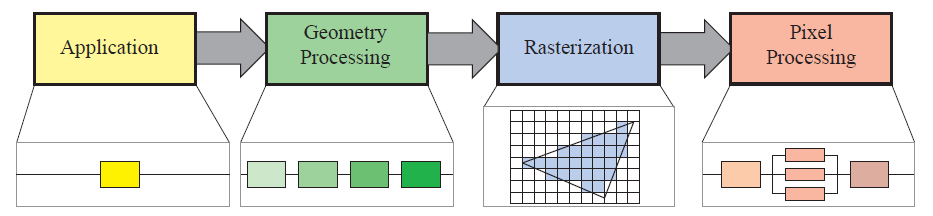

## Real Time Rendering 4th Edition
### The Graphics Rndering Pipeline

The basic construction of the rendering pipeline, consisting of four stages: application,
geometry processing, rasterization, and pixel processing