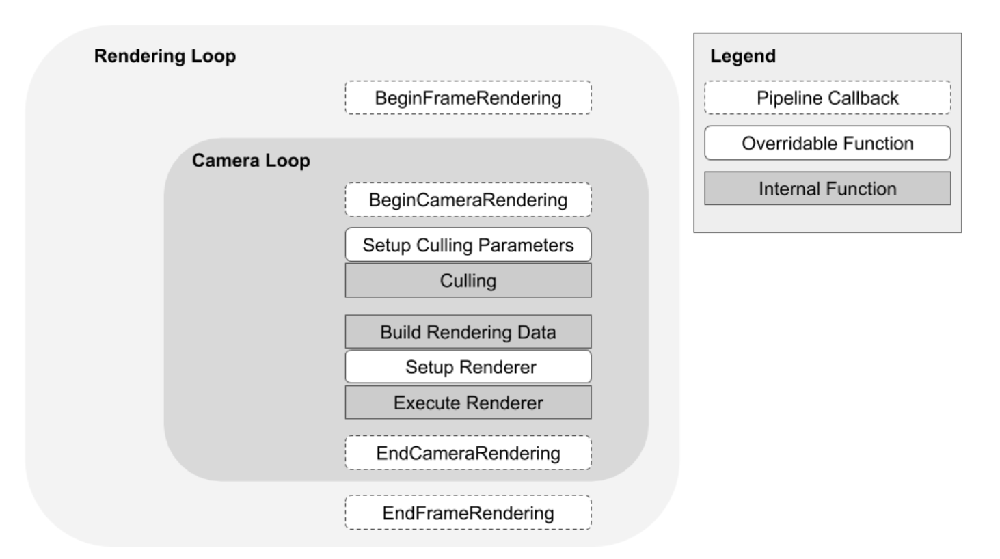
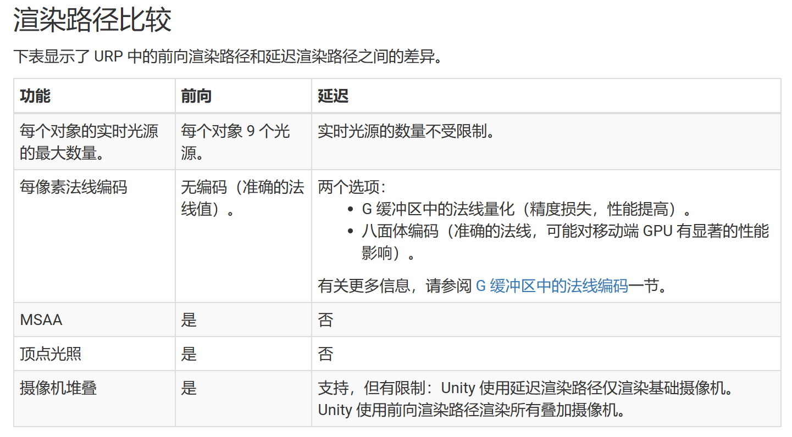
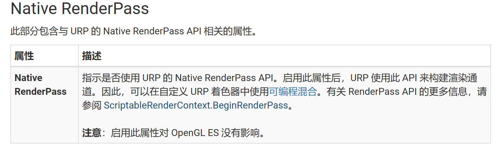
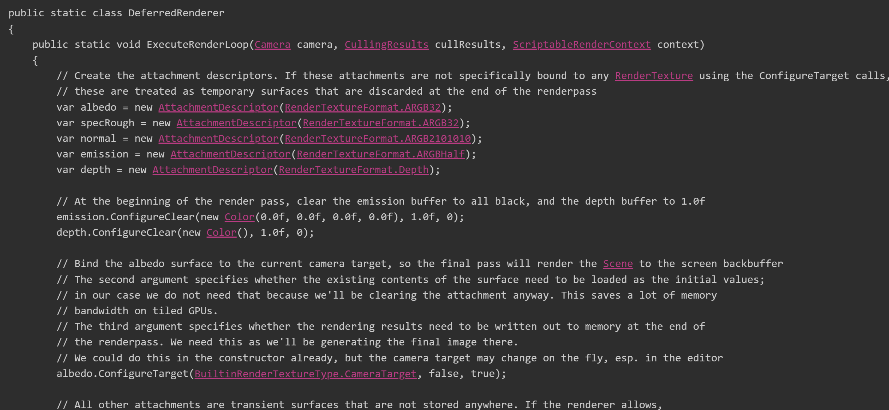
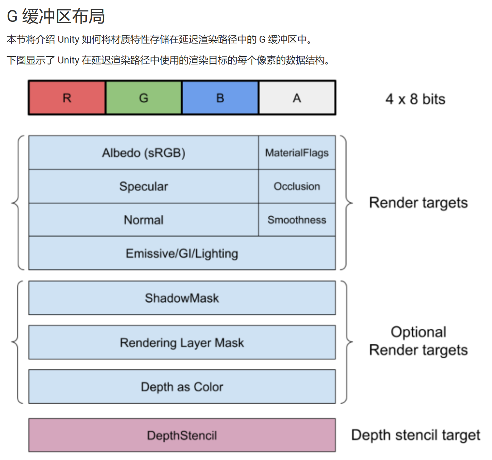

### blender

* 平移 - shift + 鼠标中间

* 旋转 - 鼠标中间

* 小键盘 各种视图

* 顶视图，数字7键

* 正视图，数字1键

* 右视图，数字3键

* 四格试图，CTRL + ALT + Q

* 游标定位
  
  * Shifr +RMB 目视定位
  * 切换到编辑模式-点模式-选择一个点， 网格|吸附|游标到选中项

* 复制物体， shift +

### unity

* 平移 - 鼠标中间
* 旋转 - Alt + 鼠标左键
* 自由行走 - 鼠标右键 + wasd

python -m eval.interpolator_cli --pattern D:\development\stable-diffusion-webui\outputs\img2img-images\20230513214507 --model_path pretrained_models\film_net\Style\saved_model --times_to_interpolate 2

### Perceptual Model for Adaptive Local Shading and Refresh Rate

* When the displays spatial and temporal sampling frequency is lower than that of the displayed signal, we see aliasing artifacts which are a common occurrence in real-time graphics

* CAMOJAB: CONTENT-ADAPTIVE METRIC OF JUDDER, ALIASING AND BLUR

* our Adaptive Local Shading and Refresh Rate (ALSaRR) algorithm that uses our motion quality metric to determine the optimal distribution of shading rate and refresh rate under a given bandwidth constraint

* Real-time implementation. To reduce the performance overhead of our method, the quality predictions of CaMoJAB (Eq. (1)) are precomputed for every texture, mipmap level, and shading rate and stored as polynomials of the form:

* In comparison to Nvidia Adaptive Shading (NAS) [Yang et al. 2019], CaMoJAB is calibrated in physical units (pixels-per-degree, degreesper-second, cd/m2 ) and accounts for the display characteristics that affect motion quality perception, such as refresh rate, duty-cycle, and field-of-view. NAS may need to be recalibrated for a display of different size, brightness or pixel density than the one used by the authors. CaMoJAB has also been calibrated with several datasets, collected using psychophysical procedures, rather than tuned by the authors

### 直播间

[抖音直播电脑版_抖音直播网页版入口_抖音直播 (douyin.com)](https://live.douyin.com/590201259059)

### python

* 工程地址 D:\dev\pythonProject

* pyqt https://maicss.gitbook.io/pyqt-chinese-tutoral/pyqt6/introduction

* pyinstaller [pyinstaller用法 - 简书 (jianshu.com)](https://www.jianshu.com/p/5ca41c87628f)

### conda

conda remove -n  需要删除的环境名 --all

git clone https://github.com/AUTOMATIC1111/stable-diffusion-webui

conda create -n novelai python==3.10.6

conda activate novelai

```text
conda deactivate
```

https://link.zhihu.com/?target=https%3A//pytorch.org/get-started/locally/

conda install pytorch torchvision torchaudio pytorch-cuda=11.6 -c pytorch -c nvidia

python -m pip install -r requirements.txt

```
cd D:\dev\stable-diffusion-webui
conda activate novelai
python launch.py --lowvram
```

```
https://zhuanlan.zhihu.com/p/575353301
masterpiece, best quality,obliques , 1girl, magic, vivid, looking at viewer, from above, black hair, black eyes, floating, flowing dress, {{{{intricate red dress}}}}, hibiscus flowers, d:, cleavage

nsfw, lowres, bad anatomy, bad hands, text, error, missing fingers, extra digit, fewer digits, cropped, worst quality, low quality, normal quality, jpeg artifacts, signature, watermark, username, blurry,

随机种子 Seed 设为：815804347
```

### 网址

https://chat.openai.com/   美国代理 + 315876632@qq.com Kl@

ai绘图(midjourney) https://discord.com/channels/662267976984297473/1008571138361790464

ai视频(d-id) https://studio.d-id.com/

win11配置深度学习环境GPU https://zhuanlan.zhihu.com/p/460806048

### AI

[Civitai](https://civitai.com/)

[Danbooru 标签超市 (novelai.dev)](https://tags.novelai.dev/)

https://github.com/AUTOMATIC1111/stable-diffusion-webui

[NovelAI.Dev](https://novelai.dev/)

### 实用工具

* windows终端
* snipaste [截图工具] [Snipaste.exe](..\..\tools\Snipaste-2.8.5-Beta-x64\Snipaste.exe) 
* Typora [md笔记]
* WSL [linux环境]
* win + V [剪切板]
* XYplorer [文件浏览器]
* TreeSize [查看文件大小]
* Ghelper [翻墙]
* aria2 [下载]
* win +X [功能中心]
* 抓住窗口的标题栏并摇动它  [win 设置]
* potplayer [视频]
* everything [搜索]
* IrfanView [图片查看工具]
* Tabnine AI [[Visual Studio Code | Install Tabnine Autocomplete for VSCode](https://www.tabnine.com/install/vscode)]
* [Moo0 前端显示器 (免费) - 添加额外的有用的菜单到窗口](https://zhs.moo0.com/?top=https://zhs.moo0.com/software/WindowMenuPlus/)
* [FSCapture.exe](..\..\tools\FSCapture100\FSCapture.exe) bluman VPISCJULXUFGDDXYAUYF
- copy contents of *C:\Program Files\WindowsApps\CanonicalGroupLimited.UbuntuonWindows_1604.2017.922.0_x64__79rhkp1fndgsc* to another directory (I copied to *C:\Ubuntu*); Windows Explorer didn't let me browse this directory so I used Total Commander (Run As Administrator) to access it and copy
- start ubuntu.exe from the new location and it should install
- use ubuntu.exe from the new location going forward to start up bash etc.


https://github.com/microsoft/WSL/issues/2577

### 技巧

```
var input = document.querySelector(".webcast-chatroom___textarea");
input.value = "求关注111"
var button = document.querySelector(".webcast-chatroom___send-btn");
button.click();


// 定义一个变量来存储定时器的标识符
var timer;
// 使用setInterval函数创建一个定时器，每隔500毫秒执行一次console.log函数
timer = setInterval(function(){
  console.log("Hello World");
}, 500);

async function sleep(ms) {
  return new Promise(resolve => setTimeout(resolve, ms));
}

function fireKeyEvent(element, evtType, keyChar) {
  element.focus();
  var KeyboardEventInit = {key:keyChar, code:"", location:0, repeat:false, isComposing:false};
  var evtObj = new KeyboardEvent(evtType, KeyboardEventInit);
  element.dispatchEvent(evtObj);
}

var timer;
var i = 0;
timer = setInterval(async function(){
    i++;
    var input = document.querySelector(".webcast-chatroom___textarea");
    input.value = "求关注求关注求关注求关注求关注求关注" + i
    fireKeyEvent(input, "keydown", "Enter");
    await sleep(1000);
    var button = document.querySelector(".webcast-chatroom___send-btn");
    button.click();
}, 5000);

var i = 0;
i++;
var input = document.querySelector(".webcast-chatroom___textarea");
input.value = "求关注求关注求关注求关注求关注求关注" + i
var button = document.querySelector(".webcast-chatroom___send-btn");
button.click();
```

### ffmpeg

```
ffmpeg -y -r 30.0 -i %5d.png -c:v libx264 -vf fps=30.0 -pix_fmt yuv420p -crf 17 -preset veryfast video.mp4
ffmpeg -i output.mp4 -r 30 -f image2 %03d.png
```

### Unity学习

[通用渲染管线资源 | Universal RP | 12.1.1 (unity3d.com)](https://docs.unity3d.com/cn/Packages/com.unity.render-pipelines.universal@12.1/manual/universalrp-asset.html)

| 属性                   | 描述                                                                                                                                                                                                                                                   |
| -------------------- | ---------------------------------------------------------------------------------------------------------------------------------------------------------------------------------------------------------------------------------------------------- |
| **SRP Batcher**      | 选中此复选框可启用 SRP Batcher。如果有许多不同材质使用相同的着色器，这将非常有用。SRP Batcher 是一个内部循环，可以在不影响 GPU 性能的情况下加速 CPU 渲染。使用 SRP Batcher 时，它将替代 SRP 渲染代码内部循环。                                                                                                                    |
| **Dynamic Batching** | 启用 [Dynamic Batching](https://docs.unity3d.com/Manual/DrawCallBatching.html) 可以使渲染管线自动批处理一系列共享相同材质的小动态对象。这对于不支持 GPU 实例化的平台和图形 API 非常有用。如果目标硬件确实支持 GPU 实例化，请禁用 **Dynamic Batching**。可以在运行时更改此设置。                                                      |
| **Store Actions**    | 定义 Unity 是丢弃还是存储 DrawObjects 通道的渲染目标。选择 **Store** 选项可显著增加移动端和基于瓦片的 GPU 上的内存带宽。 <br>**Auto**：Unity 默认使用 **Discard** 选项，如果检测到任何注入的通道，则回退到 **Store** 选项。 <br>**Discard**：Unity 会丢弃以后不重用的渲染通道的渲染目标（较低的内存带宽）。 <br>**Store**：Unity 存储每个通道的所有渲染目标（更高的内存带宽）。 |

**Use Adaptive Performance**

[通用渲染管线中的渲染 | Universal RP | 12.1.1 (unity3d.com)](https://docs.unity3d.com/cn/Packages/com.unity.render-pipelines.universal@12.1/manual/rendering-in-universalrp.html)



[通用渲染器 | Universal RP | 12.1.1 (unity3d.com)](https://docs.unity3d.com/cn/Packages/com.unity.render-pipelines.universal@12.1/manual/urp-universal-renderer.html)





[Unity - Scripting API: Rendering.ScriptableRenderContext.BeginRenderPass (unity3d.com)](https://docs.unity3d.com/ScriptReference/Rendering.ScriptableRenderContext.BeginRenderPass.html)



[URP 中的延迟渲染路径 | Universal RP | 12.1.1 (unity3d.com)](https://docs.unity3d.com/cn/Packages/com.unity.render-pipelines.universal@12.1/manual/rendering/deferred-rendering-path.html)


