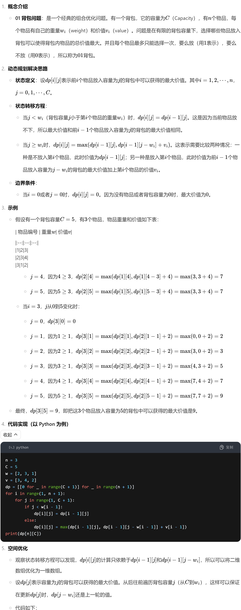
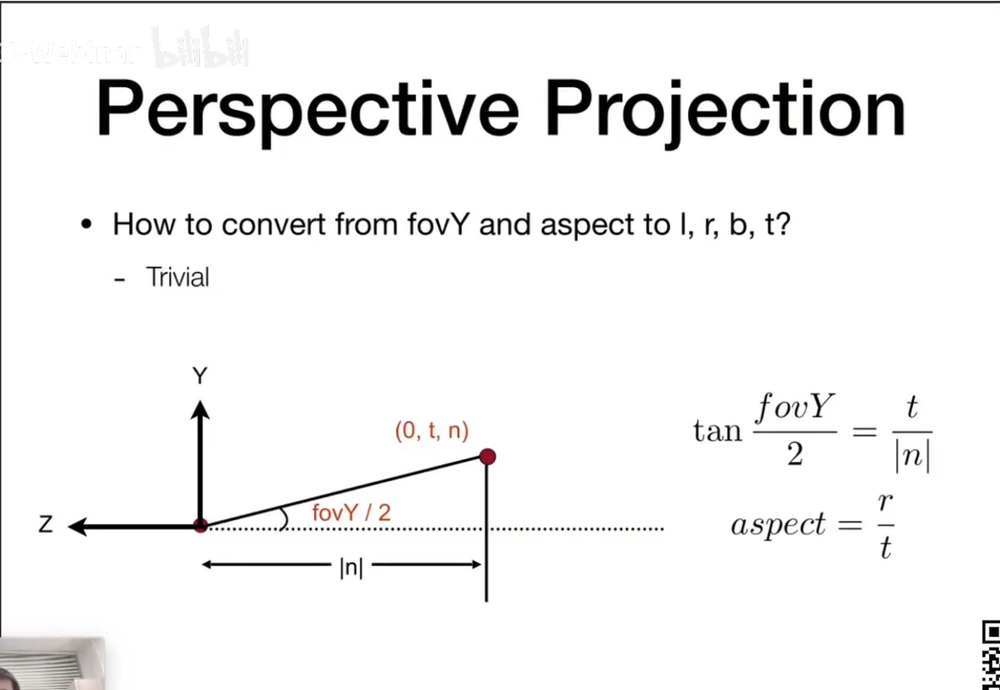
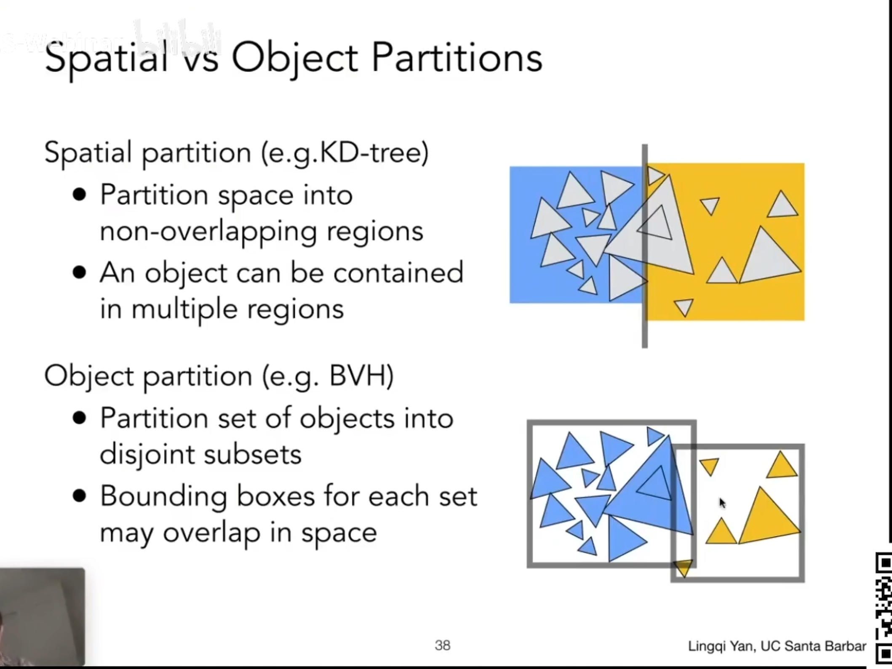
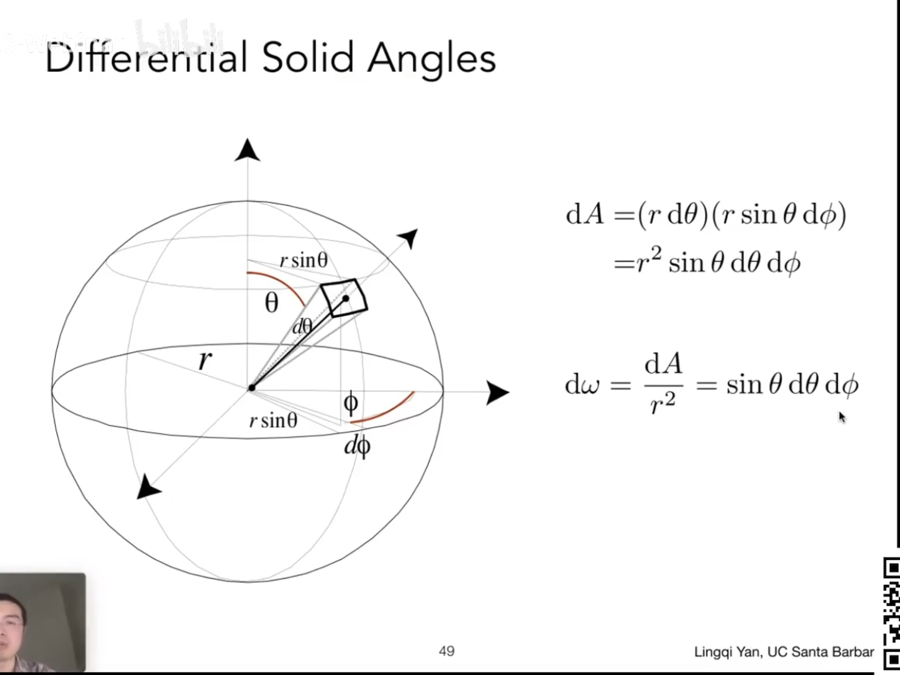
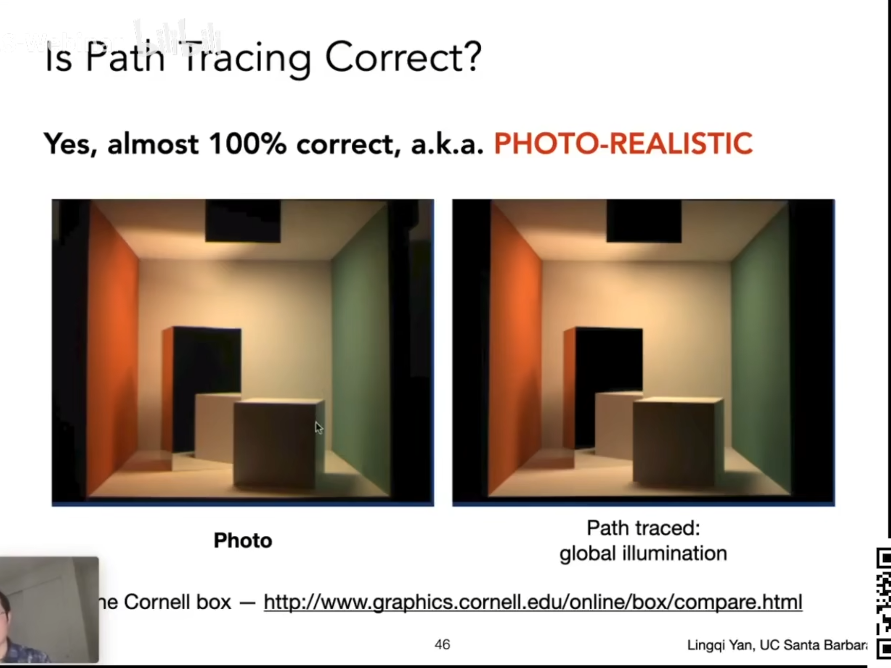
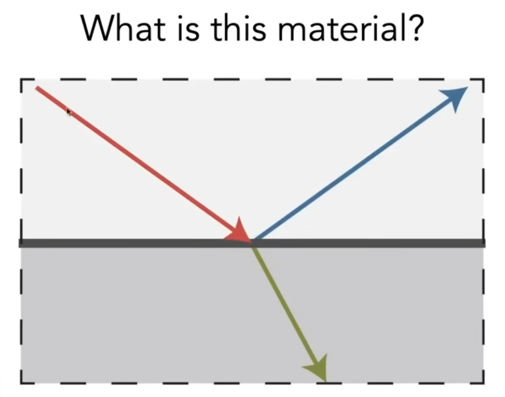

## 语录

win + H

1. 分享一个很绝的思维，请一定要把它刻进你的 DNA 里。凡是发生皆有利于我，也就是说任何困难都是在帮助我们成长，让我们学会内观，完善自我。塞翁失马，焉知非福，老天每一次安排一定有他的理由。拥有这种心态和思维，积极面对一切所谓的坏事，最终也会转变成好事。每一件事情的发生都是在帮助我，就算是烂人闹事，我也能从中发现对我有利的一面，万物皆可为我所用，失败了，分手了，就是上天在保护我，朋友走散了，就是在帮助我净化圈子，一切都是为了我服务的。我渐渐把“这种事为什么会发生在我身上”的思想转变为“这种思想教会我什么”，然后我发现身边的一切都变了。记住这三句话：我的过去不等于我的未来，我的梦想远大于我的恐惧，我是一股不可阻挡的力量。
1. 他们想要控制我的躯体，还要再绑架我思想。满腔辩论着公平，把我架在罪人之上

### 口才

简意赅表达、用细节带入画面感产生共情以及让观众感受到真诚，并通过具体事例进行了说明。

### 金句

“**人生如逆旅，我亦是行人。**” 这是宋代文学家苏轼的名句。意思是人生就是一场艰难的旅程，而我也是匆匆过客。苏轼以这样豁达的态度看待人生，表达了一种既对人生的艰辛有所认识，又能坦然处之的心境，鼓励人们以平和的心态面对生活中的起起落落。

“**世界上只有一种英雄主义，就是在认清生活的真相后依然热爱生活。**” 这句话出自罗曼・罗兰的《米开朗基罗传》。它传达了一种深刻的人生态度，告诉人们生活中难免会有不如意和艰难，但真正的勇者是在知晓这一切后，仍然能对生活充满热情和希望，积极面对人生。

“**当你为错过太阳而哭泣的时候，你也要再错过群星了。**” 这句话出自泰戈尔的《飞鸟集》。它提醒人们不要总是为过去的失去和遗憾而悲伤，否则会错过当下和未来更多的美好与机会，告诉我们要学会放下过去，珍惜眼前。


“**黑夜无论怎样悠长，白昼总会到来。**” 这句话出自莎士比亚的作品。它表达了一种乐观和坚定的信念，即无论遭遇多么漫长和黑暗的困境，总会有光明和希望到来，鼓励人们在艰难时刻保持信心和耐心。


“**生活不止眼前的苟且，还有诗和远方的田野。**” 这句话提醒人们不要只被当下的琐碎和困难所束缚，要心怀梦想，追求更美好的精神世界和未来。


虚舟触物，未尝有怒

心如莲花不浊水，又如日月不住空

人能虚已以由世，其孰能害之

你看日出多晃眼，日落在人间


## 数学

### 泰勒公式

[泰勒公式，39分钟，小白也直接上手！|高等数学_哔哩哔哩_bilibili](https://www.bilibili.com/video/BV12G411U7tD/?spm_id_from=333.337.search-card.all.click&vd_source=c5f5babdad262f8e9b8356b8fad45391)


### 最小二乘法

[数学建模之数据拟合（3）：最小二乘法_哔哩哔哩_bilibili](https://www.bilibili.com/video/BV1q741177US/?spm_id_from=333.337.search-card.all.click&vd_source=c5f5babdad262f8e9b8356b8fad45391)


### 傅里叶变换

[B站首发！草履虫都能看懂的【傅里叶变换】讲解，清华大学李永乐老师教你如何理解傅里叶变换，辨清美颜和变声原理，！！_哔哩哔哩_bilibili](https://www.bilibili.com/video/BV1aW4y1y7Hs/?spm_id_from=333.337.search-card.all.click&vd_source=c5f5babdad262f8e9b8356b8fad45391)


[傅里叶变换这样学，何愁不会呢？直观理解傅里叶变换_哔哩哔哩_bilibili](https://www.bilibili.com/video/BV1uY411z7uk/?spm_id_from=333.337.search-card.all.click&vd_source=c5f5babdad262f8e9b8356b8fad45391)


#### 快速傅里叶变换（FFT)


#### FFT在图像处理中的基本原理


## 算法

### 01背包




### [825. 适龄的朋友 - 力扣（LeetCode）](https://leetcode.cn/problems/friends-of-appropriate-ages/description/)

```c++
class Solution {
public:
    int numFriendRequests(vector<int>& ages) {
        int ans = 0;
        int n = ages.size();
        sort(ages.begin(), ages.end());
        int left = 0;
        int right = 0;
        for (auto x : ages) {
            if (x < 15) {
                continue;
            }
            while(ages[left] <= 0.5 * x + 7) {
                left++;
            }
            while(right < n && ages[right] <= x) {
                right++;
            }
            ans += right - left -1;
        }
        return ans;
    }
};
```

方法一：排序 + 双指针

方法二：计数排序 + 前缀和

## 图形

### LK光流

[经典光流算法Lucas-Kanade（有图助理解）-CSDN博客](https://blog.csdn.net/leviopku/article/details/121773298)


### 论文阅读

闫令琪 [Lingqi Yan: Research Homepage (ucsb.edu)](https://sites.cs.ucsb.edu/~lingqi/)

霍宇驰 [Yuchi Huo (zju.edu.cn)](http://www.cad.zju.edu.cn/home/huo/)

#### 《Perceptual Model for Adaptive Local Shading and Refresh Rate》

* When the displays spatial and temporal sampling frequency is lower than that of the displayed signal, we see aliasing artifacts which are a common occurrence in real-time graphics

* CAMOJAB: CONTENT-ADAPTIVE METRIC OF JUDDER, ALIASING AND BLUR

* our Adaptive Local Shading and Refresh Rate (ALSaRR) algorithm that uses our motion quality metric to determine the optimal distribution of shading rate and refresh rate under a given bandwidth constraint

* Real-time implementation. To reduce the performance overhead of our method, the quality predictions of CaMoJAB (Eq. (1)) are precomputed for every texture, mipmap level, and shading rate and stored as polynomials of the form:

* In comparison to Nvidia Adaptive Shading (NAS) [Yang et al. 2019], CaMoJAB is calibrated in physical units (pixels-per-degree, degreesper-second, cd/m2 ) and accounts for the display characteristics that affect motion quality perception, such as refresh rate, duty-cycle, and field-of-view. NAS may need to be recalibrated for a display of different size, brightness or pixel density than the one used by the authors. CaMoJAB has also been calibrated with several datasets, collected using psychophysical procedures, rather than tuned by the authors

作者为Akshay Jindal、Krzysztof Wolski、Karol Myszkowski和Rafał K. Mantiuk，该论文提出了一种基于视觉感知模型的自适应局部着色和刷新率控制方法（ALSaRR），以在有限的渲染预算下最大化动画内容的质量。

1. **研究背景**
   - **渲染挑战**：随着显示器分辨率和刷新率的提高，着色计算需求显著增长，而GPU的计算能力和带宽有限，且移动游戏等需要在有限的功率预算下运行，因此需要更灵活的着色机制。
   - **相关技术**：可变率着色（VRS）技术可在每个16×16图像块中控制着色分辨率，但现有工作对其利用不足，未充分考虑纹理内容、运动速度等因素对图像质量的影响。
2. **相关工作**
   - **运动质量模型**：主要有黑盒和白盒两种建模方式，白盒模型更依赖于心理物理模型且更适合外推预测，现有的白盒模型如MARRR、NAS等存在未考虑内容对运动质量的影响、未考虑某些运动伪影等问题。
   - **运动自适应渲染**：传统的光栅化框架直到最近才允许亚图像级别的控制，现有技术主要集中在为VR渲染进行优化，且大多未从感知角度进行优化。
   - **固定带宽渲染**：在固定带宽下优化渲染资源分配的问题在率失真理论中有研究，但常见解决方案不适合实时渲染，本文提出的优化方法与Li等人的方法类似，通过整数线性规划问题找到近似解，并在GPU上实现并行计算以满足实时渲染需求。
3. **CaMoJAB：内容自适应的抖动、混叠和模糊度量**
   - **目标**：设计一个运动质量模型，能根据显示配置和图像预测质量如何随显示刷新率、着色分辨率、显示持久性和图像速度变化，且模型要简单并涵盖广泛的显示参数和运动伪影，同时考虑纹理内容对质量退化的影响。
   - **空间失真模型**：分析了VRS渲染流水线中纹理经历的量化、存储、纹理查找、显示等阶段，以及这些阶段中引入的各种空间失真，包括可变率着色、眼动模糊等，并通过傅里叶变换等方法在频率域进行分析，最后用Lorentzian函数近似sinc函数以解决模型预测中的非单调性问题。
   - **时间失真模型**：类似Denes等人以内容自适应的方式建模时间抖动，分析信号在频率域中因时间采样产生的副本（aliases）导致的运动不平滑现象，通过计算CSF归一化视觉能量来近似总时间失真。
   - **实验1**：通过比较不同着色率和纹理的动画，测量VRS运动质量，结果表明运动质量取决于多种显示和内容相关因素，且本文模型CaMoJAB能正确预测质量差异的变化趋势，优于其他模型。
   - **模型校准与验证**：使用实验数据和其他数据集校准模型参数，验证了模型的泛化能力。
4. **自适应局部着色和刷新率（ALSaRR）**
   - **概述**：ALSaRR算法使用运动质量度量来确定在给定带宽约束下着色率和刷新率的最优分布，输入包括允许的带宽、运动向量、纹理IDs、mipmap级别和亮度等辅助缓冲区。
   - **辅助缓冲区**：渲染辅助信息到G - buffer以提供质量度量所需的纹理、映射、亮度和速度等信息，使用前一帧近似亮度以避免额外着色。
   - **最优刷新率**：类似MARRR，将刷新率选择表示为优化问题，通过预计算最佳组合来降低实时渲染的开销。
   - **最优着色率**：将屏幕空间图像划分为VRS块，计算每个块在不同着色率下的质量和带宽，使用近似贪婪求解器找到在有限着色预算下最大化质量的着色率分布。
   - **眼动速度**：由于ALSaRR控制着色率局部化，可假设眼睛能跟踪每个16×16块的运动，从而无需眼动跟踪，与MARRR方法相比具有实际优势。
   - **实现细节**：在Unity中实现原生插件，测试了方法在不同场景下的性能，结果表明ALSaRR方法优于固定刷新率分辨率和MARRR方法，但在某些场景中存在一些问题，如对包含硬阴影的场景处理不佳。
5. **局限性和讨论**
   - 假设眼睛能跟踪每个VRS块的运动是保守的，若知道注视位置可进一步优化渲染预算分配，且方法可与中心凹渲染结合以提高质量。
   - CaMoJAB未考虑对比掩蔽、颜色退化、中心凹或显著性等因素，部分原因是数据稀缺和实时性要求，且未考虑个体差异。
   - 与Nvidia Adaptive Shading（NAS）相比，CaMoJAB在物理单位上校准且使用多个数据集，而NAS可能需要针对不同显示重新校准。
   - ALSaRR的主要缺点是质量度量未考虑最终图像中的着色信息，导致对一些情况（如反射、透明物体和程序性粒子系统）分配的着色率非最优，可通过预计算最坏情况的着色来解决。
   - 当前ALSaRR基于像素每秒的渲染预算运行，而大多数应用受GPU周期功率限制，但这并非根本限制。
6. **结论**
   - ALSaRR方法利用视觉系统的限制来重新分配渲染预算，关键组件是新的度量CaMoJAB，它考虑了VRS在给定刷新率下引入的抖动、混叠和模糊伪影如何被保持型模糊、眼动模糊和视觉系统有限的时空敏感性掩盖，该度量能解释多个数据集。
   - 该技术有望改善常规自适应同步显示器和VR头显的视觉质量，可降低渲染成本并延长电池寿命，特别是与中心凹渲染结合时。

#### 《Mob-FGSR: Frame Generation and Super Resolution for Mobile Real-Time Rendering》

[Mob-FGSR: Frame Generation and Super Resolution for Mobile Real-Time Rendering](https://mob-fgsr.github.io/)

[sites.cs.ucsb.edu/~lingqi/publications/paper_sig24mobfgsr.pdf](https://sites.cs.ucsb.edu/~lingqi/publications/paper_sig24mobfgsr.pdf)

作者为浙江大学的Sipeng Yang、Qingchuan Zhu、Junhao Zhuge等人以及OPPO Computing & Graphics Research Institute的Qiang Qiu、Chen Li、Yuzhong Yan等人。

随着智能手机等移动平台在交互式数字娱乐和增强现实中的应用增加，高质量实时渲染变得至关重要。然而，移动平台受限于GPU性能和功耗预算，需要先进的渲染加速技术。现有的超采样技术虽能提高图像质量，但依赖高端硬件和神经网络，不适合移动平台。

为解决此问题，作者提出了Mob - FGSR，一个专为移动设备设计的轻量级超采样框架，它集成了帧生成和超分辨率以提高实时渲染性能，主要包括以下三个关键部分：

1. **基于斑点的运动向量（MVs）重建**：通过分析连续帧估计精确的像素运动，使用渲染帧的MVs和深度来构建生成帧的MVs，并通过斑点方法和原子操作来处理冲突和间隙，从而实现准确的像素级运动估计。
2. 高质量生成帧重建：
   - **插值**：使用相邻I帧的MVs分别对两个帧进行扭曲，然后通过优先从时间上更近的帧采样颜色、处理遮挡和阴影变化等方式来融合两个帧，以创建B帧。
   - **外推**：通过直接使用I帧1的MVs来填充外推帧MVs中的遮挡区域，以解决外推帧构建中遮挡区域的问题。
3. **快速分辨率提升**：引入独立的SR模块，通过基于查找表（LUT）的方法进行高效图像扭曲，并通过像素校正和融合来提升图像分辨率。

作者进行了数据驱动的优化，包括学习LUT和参数校准。实验结果表明，该框架在Unity和UE场景中均有较好的性能，与现有方法相比具有一定的优势，且在移动设备上的运行效率极高。

该方法的局限性包括：在帧生成中忽略了阴影、反射和透明对象的变化，可能导致低帧率效果；MVs重建方法在遮挡区域可能引入重影伪影。未来的研究可以探索类似于G - buffer引导扭曲的轻量级遮挡填充方法来解决这些问题。

#### 《Visually Lossless Content and Motion Adaptive Shading in Games》

作者为NVIDIA Corporation的LEI YANG等人，文章介绍了一种在游戏中基于场景内容和运动自适应调整着色率的技术，以在不损失感知质量的情况下提高性能。

**1. 引言**

- 现代视频游戏中每像素着色成本大幅增加，更高分辨率和帧率的需求使满足着色需求变得困难，且在移动平台上，通过减少着色来节省电量也日益重要。
- 提出一种利用GPU的可变率着色（VRS）功能自适应降低每个固定大小屏幕瓦片着色率的算法，重点是导出质量损失估计器和确定在运行时何时可以降低着色率而不会导致明显伪影的机制。
- 算法可分为三个阶段：使用提出的损失估计器分析前一帧渲染的像素；预测当前帧中不同降低着色率和运动速度下每个屏幕瓦片的误差；使用感知校正的可见性阈值决定每个屏幕瓦片使用的着色率。

**2. 背景和相关工作**

- **可变率着色（Variable - Rate Shading）**：介绍了降低每个显示像素着色计算量的多种技术，如多分辨率或混合分辨率着色、解耦和纹理空间着色、棋盘格渲染和可变率（粗像素）着色等，并详细说明了VRS的工作原理，它是当今GPU的一个功能，像NVIDIA的Turing和Intel的Gen11架构都支持，对渲染管道影响小。
- **感知引导的自适应着色（Perception Guided Adaptive Shading）**：调整着色或采样率以适应内容的想法由来已久，在虚拟现实应用中有更关键的需求，大多数进展集中在该领域，如多投影方法和中心凹渲染，本文目标是为硬件上可用的着色样本模式寻求误差估计的正式推导，并引入运动影响。
- **运动中的感知图像质量（Perceptual Image Quality in Motion）**：介绍了LCD持续显示像素导致运动物体模糊的现象，以及相关的研究和解决方法，如应用1D盒滤波器和后期处理运动模糊，这些效果为降低着色率提供了机会。

**3. 内容自适应着色（Content Adaptive Shading）**

- **图像误差与半速率着色（Image Error with Half - Rate Shading）**：假设全分辨率着色的单通道亮度图像块为I，定义了半速率着色时图像块I与I_H之间的误差项E(I, I_H)为像素差值的L2范数。
- **频域分析（Frequency Domain Analysis）**：误差项中的I_i - I_i - 1 / 2是一个线性有限脉冲响应（FIR）滤波器D，它是一个高通滤波器，提取图像的高频内容。根据卷积和帕塞瓦尔定理，该能量项可以在频域中计算，并且发现D可以表示为单位冲激滤波器H和两像素宽的盒滤波器B2的差。
- **四分之一速率着色（Quarter - Rate Shading）**：通过对齐半速率和四分之一速率着色的误差项，利用Delta方法和自然图像的平均傅里叶幅度斜率特性，得出四分之一速率着色的图像误差估计可以重用现有的半速率误差估计器，即E(I, I^Q)≈k·E(I, I^H)，其中k = 2.13。
- **着色率适应与感知校正阈值（Shading Rate Adaptation with a Perceptually - Corrected Threshold）**：根据韦伯定律定义了一个刚好可察觉差异（JND）阈值τ_I = t·(I_avg + l)，基于此确定图像块的着色率S_I。

**4. 运动自适应着色（Motion Adaptive Shading）**

- **运动模糊下的误差减小（Diminished Error Under Motion Blur）**：定义了运动补偿误差项E(I, I^H, v)，通过近似计算得出E(I, I^H, v)≈b_H(v)·E(I, I^H)和E(I, I^Q, v)≈b_Q(v)·E(I, I^H)，并拟合出b_H(v)和b_Q(v)的封闭形式函数。
- **独立运动自适应着色（Standalone Motion Adaptive Shading）**：在某些应用中，希望将运动自适应着色作为独立优化实现，通过简化速率决策标准，根据b_H(v)和相对误差的关系，确定了启用半速率着色的条件，类似地可以计算启用四分之一速率着色的条件，但使用常数近似相对误差可能会错过某些优化机会。

**5. 实现（Implementation）**

- **内容适应（Content Adaptation）**：在着色率计算过程中，将前一帧的最终图像绑定为纹理，通过重新投影像素来分析每个瓦片的内容变化，计算水平和垂直亮度差分项以及平均亮度，通过优化的计算内核提高效率。
- **运动适应（Motion Adaptation）**：获取每个像素的运动向量，将其缩小为每个瓦片的最小运动向量，然后计算运动相关的误差缩放器b_H(v)和b_Q(v)。
- **应用调整后的着色率（Applying Adjusted Shading Rate）**：计算每个瓦片的着色率并保存到着色率纹理中，然后绑定该纹理并启用VRS，无需更改着色程序或其他管道状态。
- **可选的质量改进（Optional Quality Improvements）**：为了缓解预测着色误差在阈值附近导致的着色率振荡以及自适应着色引入的反馈循环问题，可以应用两个阈值t + 和t - 来引入滞后，还可以通过限制相邻瓦片的速率差异来平滑过渡，并根据表面材质属性选择性控制着色率的适应影响。

**6. 结果（Results）**

- **图像质量（Image Quality）**：在两个高端游戏引擎中实现了内容和运动自适应着色，经过仔细测试和改进以确保在不同场景、材料和光照效果下的视觉等效性。运动自适应着色与引擎内运动模糊效果进行比较，通过调整误差灵敏度阈值t可以在质量和性能之间取得期望的平衡。
- **性能（Performance）**：自适应着色目前在两个引擎中都启用在不透明、非alpha测试的前向着色通道上，性能提升高度依赖于三个因素：VRS启用的绘制调用占用的帧时间百分比、平均图元到像素的大小比以及像素着色器的复杂性。总体上观察到平均绘制调用时间减少20% - 60%，平均帧时间减少5% - 20%，在有场景或相机运动时性能提升更明显，运动自适应着色还可以补偿运动模糊效果的开销。

**7. 结论和未来工作（Conclusion and Future Work）**

- 提出的技术利用了最新一代GPU上的可变率着色功能，实现了稳定的性能改进且没有感知到的图像质量损失，期望该技术能被广泛采用。
- 未来考虑将自适应着色应用于更多类型的着色和后期处理通道，这可能需要更多的引擎集成工作，但有助于加速帧内剩余的工作负载。


#### 《Temporal Resolution Multiplexing: Exploiting the limitations of spatio-temporal vision for more efficient VR rendering》

作者为来自英国剑桥大学的Gyorgy Denes、Kuba Maruszczyk、George Ash和Rafał K. Mantiuk。

文章提出了一种名为Temporal Resolution Multiplexing（TRM）的技术，可降低虚拟现实（VR）渲染的带宽和计算成本，主要内容总结如下：

1. 研究背景：
   - 现代VR系统对实时渲染要求极高，包括高分辨率、高刷新率（90Hz）、低延迟以及强抗锯齿等，这导致了过高的渲染成本，且对从GPU到显示器的帧传输带宽提出了挑战。
2. 相关工作：
   - 介绍了利用视觉系统有限积分时间来提高图像分辨率的 temporal multiplexing技术，以及与之相关的反向和正向重投影技术，用于减少渲染成本。
   - 讨论了LCD和OLED两种主流显示技术在显示高帧率动画时的相关问题，如非平滑运动、重影、空间模糊和闪烁等。
   - 提及过去为改善编码性能而对中间帧进行模糊处理的尝试，但这些方法未被纳入编码标准，且在低速度时运动锐化不足。
3. 对高帧率视频的感知：
   - 大多数人工光源包括显示器的闪烁频率很高，以致于我们看到的是稳定光的印象，这涉及到临界融合频率（CFF）和Talbot - Plateau定律等概念。
   - 视觉系统对时空频率的敏感性以及运动锐化效应等会影响对物体的感知。
4. 时间分辨率复用（TRM）：
   - 目标是减少驱动高帧率显示器（如VR头集中使用的那些）所需的带宽和计算，通过对奇偶帧分别进行不同分辨率的渲染并进行补偿，来降低渲染和传输的数据量，同时确保减少几乎不可察觉。
   - 具体包括帧集成、解决过冲和下冲问题、处理相位失真以及准确建模显示器发光等步骤。
5. 实验1：分辨率降低与帧率：
   - 通过心理物理学实验分析刷新率和降低因子等参数对TRM渲染运动质量的影响，结果表明对于大多数动画，分辨率为0.4或更低的降低因子可产生与全分辨率渲染难以区分的动画。
6. 与其他技术的比较：
   - 将TRM与其他旨在改善运动质量或减少图像传输带宽的技术进行比较，如帧率减半、隔行扫描、插入黑帧、NCSFI等，指出TRM在减少带宽的同时能更好地提高运动的平滑性。
7. 应用：
   - 传输方面，TRM可将帧数据传输带宽减少37 - 49%，且能与传统编码（如JPEG XS）结合进一步提高编码效率。
   - VR方面，通过交替渲染双眼不同分辨率的视图来更好地分布渲染负载，可减少37 - 49%的像素渲染数量，并在现有渲染管线中易于集成。
   - 高帧率显示器方面，该技术可用于降低HFR视频传输的带宽，但高帧率的优势在传统视频内容中较难体现。
8. 实验2和3：在VR中的验证：
   - 在HTC Vive和Oculus Rift上进行实验，比较TRM与基线渲染以及NCSFI和ASW两种替代技术，结果表明TRM与原始90Hz渲染几乎无差异，NCSFI和ASW存在不同程度的问题。
9. 局限性：
   - TRM仅适用于能显示90帧/秒或更高的高刷新率显示器，且在低帧率时会出现闪烁；需要对使用的显示器进行特性描述，对于LCD面板来说这更复杂；需要渲染中间帧，这对于非片段受限的场景会降低性能增益，同时会增加内存占用。
10. 结论：
    - TRM利用视觉系统对高时空频率细节感知的有限能力，减少渲染像素数量以产生平滑运动，易于集成到现有光栅化管线中。
    - 未来可探索在较低帧率下避免闪烁伪影的可能性，以及结合色度子采样的可能性。

综上，该文章提出的TRM技术在降低VR渲染成本和带宽方面具有潜在优势，通过实验验证了其有效性，并讨论了相关的局限性和未来工作方向。

#### FSR3

https://gpuopen.com/gdc-presentations/2024/GDC2024_High_Performance_Rendering_in_Snowdrop_Using_AMD_FidelityFX_Super_Resolution_3.pdf

[FidelityFX Super Resolution 3.0.3 (FSR3) - Interpolation - FidelityFX SDK - AMD GPUOpen](https://gpuopen.com/manuals/fidelityfx_sdk/fidelityfx_sdk-page_techniques_super-resolution-interpolation/)

[FidelityFX Optical Flow 1.0 - FidelityFX SDK - AMD GPUOpen](https://gpuopen.com/manuals/fidelityfx_sdk/fidelityfx_sdk-page_techniques_optical-flow/#doxid-page-techniques-optical-flow)


这个网页是关于在Snowdrop中使用AMD FidelityFX™ Super Resolution 3（FSR 3）实现高性能渲染的文档，主要内容包括以下几个方面：

1. FSR 3的发展历程：
   - 从FSR 1的空间升频到FSR 2的时间升频，再到FSR 3增加的帧生成功能。
   - FSR 3于2022年开始由小团队开发，采用算法解决方案，支持原生AA模式并修复了相关bug，采用广泛的应用策略。
2. 常见帧生成选项：
   - 插值（Interpolation）：在两个数据点之间生成数据，会增加延迟，但数据更可靠。
   - 外推（Extrapolation）：在数据点之外生成数据，延迟可能较低，但数据可信度较低。
   - 两种选项在帧排布上都有挑战。
3. FSR 3的帧插值：
   - FSR 3使用帧插值，能更自信地对数据采样以生成帧，潜在地减少伪影，但也面临非线性运动、插值位置确定、确保高fps以提高近似度、高频区域插值伪影、游戏运动向量与屏幕呈现图像不匹配以及少量额外延迟等挑战。
4. 延迟：
   - 衡量指标包括现有显示原生渲染延迟、升频到显示原生渲染延迟以及升频到显示 + 帧生成渲染延迟。
   - 当FSR 3启用升频和FG时，延迟应落在升频仅和原生渲染之间的区域。
5. 运动向量：
   - 帧生成使用来自升频的运动向量作为输入，但运动向量存在一些问题，如不匹配最终呈现的图像、用户界面、后处理效果、透明物体和粒子等。
   - 光学流可以在运动向量不足时协助减少伪影。
6. FSR 3的光学流 - 优化的流体运动帧（FMF）：
   - 从原始OpenCL FMF代码库重新设计了原生HLSL光学流。
   - 试验了各种配置操作的选项，以在可检测性和误报运动之间进行权衡，并考虑性能影响。
   - FSR 3使用单一模式，在广泛的输入范围内提供良好的结果。
7. 生成插值帧：
   - 输入包括运动向量场、计算遮挡、重投影和对信心不足区域的修复。
   - 修复使用帧的mip金字塔来填充低信心数据的间隙，但在处理半透明物体、快速动态阴影、晕影后处理等方面仍存在挑战。
8. 用户界面：
   - 在生成新帧时，用户界面很容易被破坏，因为游戏的运动向量来自场景，而不是用户界面覆盖。
   - 建议使用回调功能在生成的帧上重新渲染用户界面，以获得全显示率的用户界面。
   - 也可以支持一种模式，FSR 3在提供有和没有用户界面的资源时尝试生成帧并保持低伪影，但可能会出现伪影。
   - 请参考虚幻引擎插件提供的文档，以获取无伪影用户界面的可用选项。
9. 帧排布：
   - 由于跨平台要求，没有驱动参与，这使得帧排布具有挑战性。
   - 连接交换链的事物可能会改变飞行中的数据并增加gpu渲染成本。
   - 跨平台解决方案连接dx12运行时，可能会受到图形覆盖、性能测量工具、屏幕录制工具和非全屏运行的影响。
   - 帧插值交换链将游戏循环与呈现解耦，以控制呈现调用的节奏，但集成可能是最困难的部分，因为有很多变动部分。
10. 帧排布的等待：
    - 等待确保呈现调用在由先前帧时间的滚动平均值控制的范围内发生。
    - 无法测量覆盖图的成本，因为它们超出了控制范围，建议在没有覆盖图的情况下进行游戏和基准测试。
11. 可变刷新率的排布改进：
    - 发现GPU硬件、硬件调度、操作系统和显示器会显著改变VRR体验。
    - 使用工具检测显示帧中的撕裂，以指示不良的排布。
    - 经过测试，“模糊”的图形提供了最佳的屏幕体验，硬件调度在操作系统中启用时也会有所帮助。
12. 性能和集成考虑：
    - 生成帧的成本低，Shader Model 6.2是最低硬件要求。
    - 异步计算可以隐藏工作负载并提高性能，但需要仔细集成，非异步计算可以节省内存。
    - 延迟通常在升频仅到原生显示分辨率的范围内。
13. 集成调试：
    - AMD FSR 3具有用于集成测试的调试视图，可通过配置FFX_FSR3_FRAME_GENERATION_FLAG_DRAW_DEBUG_VIEW标志启用。
14. 在Snowdrop中集成FSR：
    - 使用自定义渲染器，通过FfxInterface将FSR连接到自己的渲染器，以获得最低的开销。
    - 在设置FfxContext时定义钩子，创建资源和管道，并在运行时注册外部资源。
    - 自定义资源类型，根据使用情况进行初始化，并使用FFX_RESOURCE_FLAGS_ALIASABLE允许瞬态资源，实现即时分配，最小化内存开销。
    - FSR附带原生HLSL源，将其转换为mshader，并添加额外功能（如Bindless、自定义加载函数等），尊重排列。
    - 外部资源要求包括深度、运动向量、反应性（可选）、透明度和合成（可选）以及HUD - less游戏场景和分离的UI。
    - 运动向量的精度至关重要，Snowdrop运动向量编码了元数据，需要直接采样全局运动向量资源并排除元数据。
    - 反应性控制历史插值，在Snowdrop中是二元的，未来将转向UNORM纹理以实现细粒度控制。
15. Snowdrop渲染管道：
    - FSR 3在Snowdrop渲染管道中的位置包括预后期效果和呈现。
    - 具体包括主渲染图形、计算、更新队列管理器、DMA命令列表打开/关闭、FSR 3插值线程、FSR 3排布线程、GPU图形、GPU计算1、GPU帧生成、GPU短任务和GPU呈现等。
    - FSR 3的帧生成分析地生成额外的帧，提高显示率，使游戏感觉更流畅，但需要自定义交换链实现，帧排布比较棘手，同时也为平台无关的帧生成打开了大门。
    - 自定义交换链受AMD交换链实现的启发，进行了一些调整，包括使用围栏、测试各种睡眠以进行排布、处理V - sync带来的困难以及使用单独的CPU线程处理时间计算等，还允许直通模式以避免重新创建交换链的成本，但重新创建交换链可能会出现问题。
    - 合成用户界面可以选择全速率渲染或半速率渲染，全速率渲染需要更改管道，选择半速率渲染则需要额外复制用户界面纹理，并且背景模糊可能会出现问题。
16. 结论：
    - FSR 3与自身的TAA相比具有卓越的质量、高性能，并在所有主要平台上运行，但目前帧生成仅在PC上可用。
17. AMD FSR 3.1的介绍：
    - 包括升频改进、各种修复、支持Vulkan和Xbox Game Development Kit、可以将升频与帧生成分离以及引入AMD FidelityFX API和锁定ABI等。
    - 升频改进包括内部对高频/低频信号的更改、更好地保留细节和减少时间不稳定性。
    - 分离升频和帧生成可以使帧生成与任何第三方升频组件一起运行，但需要预先计算来自升频器输入的一些数据。

总的来说，这个文档详细介绍了FSR 3在Snowdrop中的应用和相关技术细节，包括其原理、集成过程、性能优化以及未来的发展方向等。

#### 《PowerNet: Learning-based Real-time Power-budget Rendering》

http://www.cad.zju.edu.cn/home/rwang/projects/power-optimization/21powernet.pdf

随着嵌入式GPU在移动设备上的普及，节能渲染成为图形应用广泛关注的问题。本文提出了一种新的基于学习的实时功率预算渲染系统，通过选择最优渲染设置，在给定功率预算下最大化每帧的视觉质量。

1. 相关工作：
   - **渲染研究**：包括离线渲染和实时渲染，近年来节能渲染成为新的课题，包括硬件和软件解决方案，如节能显示器、动态电压和频率缩放、可变精度渲染等。
   - **神经网络在渲染中的应用**：已成功应用于去噪、材质建模、合成、屏幕空间着色和全局光照等，但本文方法以GPU的统计信息作为输入来预测功耗和渲染质量。
   - **节能渲染**：DVFS算法是集成电路和渲染中广泛使用的节能算法之一，但不减少渲染计算。已有研究提出了一些功率模型，但缺乏对多通道渲染框架的可用性。动态渲染设置是一个未被充分探索的领域，现有方法存在初始化复杂、依赖场景和视图相关测量、精度和适应性低等问题。
2. **问题定义**：将实时渲染过程抽象为图像渲染函数f，通过渲染设置s和相机参数c来定义。给定功率预算Pbgt，试图找到最优的s，使图像质量误差e(c, s)最小且功率消耗P(c, s)在预算内，这个过程称为功率预算渲染。
3. **算法概述**：算法分为神经网络训练阶段和运行时渲染阶段。在训练阶段，使用渲染统计信息训练功率和质量预测模型，数据来自虚拟场景，使模型与视图和场景无关。在运行时渲染阶段，首先使用功率预测模型预测所有渲染设置的功率消耗，找到低于给定功率预算的设置，然后根据质量预测模型选择最优渲染设置来渲染最终图像。
4. 神经网络模型用于功率预测：
   - **功率函数**：在实时渲染管道中，GPU的功耗与场景、渲染设置、相机参数等有关。
   - **网络架构**：设计的神经网络模型包含两个子网络，第一个子网络预测GPU的工作频率，第二个子网络根据预测频率和状态预测最终的GPU功率消耗。
   - **网络训练**：使用虚拟场景生成训练集，分别为移动和桌面平台训练网络，训练集混合了不同GPU的数据，以提高网络的灵活性。使用测量的工作频率和功率消耗来监督网络训练，验证集的预测误差较小。
5. 神经网络模型用于质量预测：
   - **质量函数**：提出新的质量函数Ψ来表达任意两个渲染设置之间质量误差的映射，通过当前设置的误差计算其他设置的质量误差。
   - **网络架构和训练**：设计的神经网络模型包含四个隐藏层，使用全连接层和softplus激活函数。训练数据来自虚拟场景，通过旋转相机增加数据多样性，使用均方误差作为损失函数和随机梯度下降算法作为优化器，预测质量误差的平均绝对误差较小。
6. 实时功率预算渲染框架：
   - **选择最优渲染设置**：给定场景、相机参数、功率预测模型和质量预测模型，目标是找到功率预算内质量误差最小的最优渲染设置sopt。通过两步线性搜索来实现，避免了在功率 - 误差空间中生成Pareto前沿。
   - **运行时功率预算渲染**：在渲染开始时，可立即选择最优设置进行功率预算渲染，后续每帧进行选择过程，但周期性计算质量误差。为避免视觉质量突然变化，进行时间过滤以平滑过渡到新设置。
7. 实现：
   - **功率测量**：桌面平台使用NVIDIA Management Library的C API直接测量GPU的瞬时功率，移动平台使用Android系统的内置命令读取电池的实时电压和电流值来计算瞬时功率。
   - **渲染框架**：实现了一个基于OpenGL的渲染系统，支持六种可配置的渲染效果，包括分辨率、屏幕空间反射、阴影映射、基础着色、金属着色和快速近似抗锯齿。
   - **网络输入**：功率预测网络的输入是一个20维向量，包含绘制调用、顶点、片段、质量设置和GPU模型；质量预测网络的输入是一个19维向量，包含场景信息、渲染设置和当前渲染设置的图像误差。
   - **质量误差计算**：在片段着色器中基于公式计算每像素差异，使用GPU生成1×1 mipmap来确定最终图像误差，该方法比之前使用的SSIM算法快100倍。
   - **渲染统计**：在桌面平台上使用OpenGL查询对象收集调用次数，在移动平台上通过模型计算顶点数量，通过渲染掩码和生成mipmaps来计算片段数量和百分比占用面积。
   - **实施细节**：在CPU上进行网络推理，预测功率消耗和质量误差并选择最优渲染设置，设置错误计算间隔为3秒，时间过滤窗口为2秒。在CPU上进行推理对GPU渲染的性能和质量影响可忽略，因此仅集成了CPU实现。
8. 结果：
   - **实验设置**：在不同设备上的六个场景中进行实验，设置固定帧率和分辨率，设计预定义相机路径进行测量和比较。
   - **实验结果**：框架能够显著降低功率消耗并保持低误差，在不同环境的场景中表现良好。与之前的在线方法相比，本文框架在功率预测和图像误差控制方面更稳健，能够自动平衡质量和功率消耗，且可以找到不同GPU上各种预算的最优渲染设置。
9. 讨论：
   - **优势**：克服了之前工作的局限性，不再依赖视图和场景相关的功率测量，利用GPU的工作频率提供高精度预测，实现了逐帧功率预算渲染，展示了六个典型场景的优化结果，证明了框架的有效性和灵活性。
   - **不足与改进**：功率预算可能因通用功率预测模型的精度而略有偏差，可通过专门针对自定义场景或特定硬件平台训练来提高精度；固定的错误计算间隔可满足各种情况，也可在运行时自动调整；未来可将框架扩展到新的渲染管道，进一步降低质量误差预测的成本；系统可集成到渲染引擎中，但对于使用不同引擎或相同引擎但不同渲染设置的应用需要重新训练。

综上所述，本文提出的实时功率预算渲染框架满足理想节能框架的要求，在不同平台和场景中具有通用性，且开销更少，灵活性更好，可与现有渲染引擎集成。

#### 《FuseSR: Super Resolution for Real-time Rendering through Efficient Multi-resolution Fusion》

[2310.09726 (arxiv.org)](https://arxiv.org/pdf/2310.09726)

作者为Zhihua Zhong、Jingsen Zhu等，提出了一种用于实时渲染的高效超分辨率方法FuseSR。

- **研究背景**：
  - 随着对高分辨率、高刷新率和高真实感的需求增加，实时渲染的计算工作量急剧上升，现有的超分辨率（SR）方法难以满足需求。
  - 现有方法主要利用低分辨率输入（如历史帧）中的信息，但这些输入缺乏高频细节，难以恢复高分辨率预测中的精细细节。
  - 更高的性能改进需要增加特征分辨率和减少网络带宽，但这两者难以兼顾，限制了高分辨率SR的发展。
  
- **方法概述**：
  - **利用高分辨率G-buffer**：将低分辨率（LR）图像和高分辨率G-buffer作为输入，通过预积分BRDF解调（BRDF Demodulation）将着色结果分解为预积分BRDF和解调辐照度分量，训练网络预测高分辨率辐照度，以更好地平衡质量和效率。
  - **H - Net网络架构**：采用像素解交织（pixel unshuffling）和交织（pixel shuffling）操作，无损地对齐高分辨率特征与低分辨率输入，并将特征融合到低分辨率网络主干中，同时保留高保真的高分辨率细节。
  
- **实验结果**：
  - **质量和性能比较**：在4×4和8×8上采样任务中，FuseSR方法在质量和性能上均显著优于其他基线方法。
  - **实时渲染讨论**：集成FuseSR方法到渲染管线中确实比原生渲染高分辨率图像减少了计算开销，并且可以增加现代游戏设计更复杂场景的潜力。
  - **消融实验**：验证了BRDF解调（BRDF Demodulation）和高分辨率G-buffer融合（HR G-buffer fusion）的有效性，以及像素解交织对齐策略（pixel unshuffling alignment strategy）的优越性。
  
- **结论**：
  - FuseSR方法能够根据相应的低分辨率帧预测高质量的4×4（甚至8×8）上采样重建，在质量和性能之间取得了出色的平衡，并且具有出色的通用性和时间稳定性。
  
  
  
#### Fast Extraction of Viewing Frustum Planes from the World View-Projection Matrix

  

  


### git代理

1. git config --global http.proxy http://127.0.0.1:9991
2. git config --global https.proxy http://127.0.0.1:9991
### Animatediff

animatediff stylize generate "D:\development\animatediff-cli-prompt-travel\stylize\2023-10-06T09-33-16-sample-majicmix realistic 麦橘写实_v2威力加强典藏版"

#### 网址

[guoyww/AnimateDiff: Official implementation of AnimateDiff. (github.com)](https://github.com/guoyww/AnimateDiff)

[s9roll7/animatediff-cli-prompt-travel: animatediff prompt travel (github.com)](https://github.com/s9roll7/animatediff-cli-prompt-travel)

#### 流程

```
cd animatediff-cli
venv\Scripts\activate.bat
.\venv\Scripts\Activate.ps1

# with this setup, it took about a minute to generate in my environment(RTX4090). VRAM usage was 6-7 GB
# width 256 / height 384 / length 128 frames / context 16 frames
animatediff generate -c config/prompts/prompt_travel.json -W 256 -H 384 -L 128 -C 16
# 5min / 9-10GB
animatediff generate -c config/prompts/prompt_travel.json -W 512 -H 768 -L 128 -C 16

# upscale using controlnet (tile, line anime, ip2p, ref)
# specify the directory of the frame generated in the above step
# default config path is 'frames_dir/../prompt.json'
# here, width=512 is specified, but even if the original size is 512, it is effective in increasing detail
animatediff tile-upscale PATH_TO_TARGET_FRAME_DIRECTORY -c config/prompts/prompt_travel.json -W 512

# upscale width to 768 (smoother than tile-upscale)
animatediff refine PATH_TO_TARGET_FRAME_DIRECTORY -W 768
# If generation takes an unusually long time, there is not enough vram.
# Give up large size or reduce the size of the context.
animatediff refine PATH_TO_TARGET_FRAME_DIRECTORY -W 1024 -C 6

# change lora and prompt to make minor changes to the video.
animatediff refine PATH_TO_TARGET_FRAME_DIRECTORY -c config/prompts/some_minor_changed.json
```

#### Video Sylization

```
cd animatediff-cli
venv\Scripts\activate.bat

# If you want to use the 'stylize' command, additional installation required
python -m pip install -e .[stylize]

# create config file from src video
animatediff stylize create-config YOUR_SRC_MOVIE_FILE.mp4

# Edit the config file by referring to the hint displayed in the log when the command finishes
# It is recommended to specify a short length for the test run

# generate(test run)
# 16 frames
animatediff stylize generate STYLYZE_DIR -L 16
# 16 frames from the 200th frame
animatediff stylize generate STYLYZE_DIR -L 16 -FO 200

# If generation takes an unusually long time, there is not enough vram.
# Give up large size or reduce the size of the context.

# generate
animatediff stylize generate STYLYZE_DIR
```

### blender

* SHIFT + MMB :  平移 
* MMB : 旋转 - 鼠标中键
* 小键盘 各种视图
* 数字7键 ：顶视图
* 数字1键 ： 正视图
* 数字3键 ： 右视图
* CTRL + ALT + Q ：四格试图
* 游标定位
  
  * Shift +RMB ：目视定位
  * 切换到编辑模式-点模式-选择一个点， 网格|吸附|游标到选中项
* SHIFT  + D : 复制物体
* ALT + LMB;  SHIFT +　ALT + LMB : 循环边 
* CTRL＋ALT＋LMB : 并排边 
* CTRL + SHIFT + LMB : 最短路径 
* G G : 滑移 
* CTRL + B ：倒角 
* SHIFT + CTRL + B ：点倒角 
* R R : 3D旋转 
* E ：挤出 
* ALT + E ：挤出二级菜单 
* CTRL + RMB ：挤出到光标 
* CTRL + R ：环切 
* F ：四点填充
* ALT + D ：调整顶点
* X：塌陷， 一个面坍缩为一个点
* / ：局部视图
* CTRL + J ：物体合并，
* CTRL + A ：应用物体变换
* F2：物体重命名，
* ALT +B：裁剪视图，
* m：新建集合
* CTRL + L ：关联材质等， 编辑模式，选择相连项
* Z ： 切换着色方式
*  ~ ： 切换视图
* ，：切换坐标系，
*  . ：切换基准点
* SHIFT + S：吸附
* i： 内插面
* A： 全选
* CTRL + i： 反选
* C： 刷选
* CTRL + : 扩展选区
* CTRL - ：收缩选区
* . ：居中显示
* SHIFT ：精细调节
* ALT + Z ：切换透视
* Q : 快捷键收藏夹
* CTRL + 1/ 2/3 : 添加1/2/3级别细分 ; 编辑视图，选点线面
* CTRL + P : 父子关系, 大纲中 SHIFT 拖动节点
* m: 新建集合
* CTRL + ALT + 0: 设置当前界面为摄像机界面
* ALT + G:清除位移
* 插件   [machin3io/MACHIN3tools: MACHIN3tools is a free, continuously evolving collection of blender tools and pie menus in a single customizable package. (github.com)](https://github.com/machin3io/MACHIN3tools)

### python

* 工程地址 D:\dev\pythonProject

* pyqt https://maicss.gitbook.io/pyqt-chinese-tutoral/pyqt6/introduction

* pyinstaller [pyinstaller用法 - 简书 (jianshu.com)](https://www.jianshu.com/p/5ca41c87628f)

### conda

conda remove -n  需要删除的环境名 --all

git clone https://github.com/AUTOMATIC1111/stable-diffusion-webui

conda create -n novelai python==3.10.6

conda activate novelai

```text
conda deactivate
```

https://link.zhihu.com/?target=https%3A//pytorch.org/get-started/locally/

conda install pytorch torchvision torchaudio pytorch-cuda=11.6 -c pytorch -c nvidia

python -m pip install -r requirements.txt

```
cd D:\dev\stable-diffusion-webui
conda activate novelai
python launch.py --lowvram
```

```
https://zhuanlan.zhihu.com/p/575353301
masterpiece, best quality,obliques , 1girl, magic, vivid, looking at viewer, from above, black hair, black eyes, floating, flowing dress, {{{{intricate red dress}}}}, hibiscus flowers, d:, cleavage

nsfw, lowres, bad anatomy, bad hands, text, error, missing fingers, extra digit, fewer digits, cropped, worst quality, low quality, normal quality, jpeg artifacts, signature, watermark, username, blurry,

随机种子 Seed 设为：815804347
```

### 网址

https://chat.openai.com/   美国代理 + 315876632@qq.com Kl@

ai绘图(midjourney) https://discord.com/channels/662267976984297473/1008571138361790464

ai视频(d-id) https://studio.d-id.com/

win11配置深度学习环境GPU https://zhuanlan.zhihu.com/p/460806048

### AI

[Civitai](https://civitai.com/)

[Danbooru 标签超市 (novelai.dev)](https://tags.novelai.dev/)

https://github.com/AUTOMATIC1111/stable-diffusion-webui

[NovelAI.Dev](https://novelai.dev/)

shift-attention [yownas/shift-attention: In stable diffusion, generate a sequence of images shifting attention in the prompt. (github.com)](https://github.com/yownas/shift-attention)

python -m eval.interpolator_cli --pattern D:\development\stable-diffusion-webui\outputs\img2img-images\20230513214507 --model_path pretrained_models\film_net\Style\saved_model --times_to_interpolate 2

### 技巧

```js
var input = document.querySelector(".webcast-chatroom___textarea");
input.value = "求关注111"
var button = document.querySelector(".webcast-chatroom___send-btn");
button.click();


// 定义一个变量来存储定时器的标识符
var timer;
// 使用setInterval函数创建一个定时器，每隔500毫秒执行一次console.log函数
timer = setInterval(function(){
  console.log("Hello World");
}, 500);

async function sleep(ms) {
  return new Promise(resolve => setTimeout(resolve, ms));
}

function fireKeyEvent(element, evtType, keyChar) {
  element.focus();
  var KeyboardEventInit = {key:keyChar, code:"", location:0, repeat:false, isComposing:false};
  var evtObj = new KeyboardEvent(evtType, KeyboardEventInit);
  element.dispatchEvent(evtObj);
}

var timer;
var i = 0;
timer = setInterval(async function(){
    i++;
    var input = document.querySelector(".webcast-chatroom___textarea");
    input.value = "求关注求关注求关注求关注求关注求关注" + i
    fireKeyEvent(input, "keydown", "Enter");
    await sleep(1000);
    var button = document.querySelector(".webcast-chatroom___send-btn");
    button.click();
}, 5000);

var i = 0;
i++;
var input = document.querySelector(".webcast-chatroom___textarea");
input.value = "求关注求关注求关注求关注求关注求关注" + i
var button = document.querySelector(".webcast-chatroom___send-btn");
button.click();
```

### ffmpeg

```
ffmpeg -y -r 30.0 -i %5d.png -c:v libx264 -vf fps=30.0 -pix_fmt yuv420p -crf 17 -preset veryfast video.mp4
ffmpeg -i output.mp4 -r 30 -f image2 %03d.png
```

### Edge TTS && whisper

D:\development\Edge-tts

```
edge-tts.exe --voice zh-TW-HsiaoChenNeural --f .\output\output.txt --write-media .\output\output{AudioCount}.mp3 2>nul
whisper xx.mp4 --model medium --language Chinese
```

### Unity学习

#### 操作

* 平移 - 鼠标中间
* 旋转 - Alt + 鼠标左键
* 自由行走 - 鼠标右键 + wasd

#### URP

[Deferred Rendering Path in URP | Universal RP | 14.0.11 (unity3d.com)](https://docs.unity3d.com/Packages/com.unity.render-pipelines.universal@14.0/manual/rendering/deferred-rendering-path.html)

#### Forward vs Deferred vs Forward+

[（译）Forward vs Deferred vs Forward+ Rendering with DirectX 11 | 登峰造极者，殊途亦同归。 (lfzxb.top)](https://www.lfzxb.top/forward-vs-deferred-vs-forward-plus/)

#### 自定义渲染管线学习

[GitHub - lwwhb/CustomRenderPipelineTutorials: Unity6的自定义渲染管线教程](https://github.com/lwwhb/CustomRenderPipelineTutorials)

[Unity6 自定义渲染管线 | Unity 中文课堂](https://learn.u3d.cn/tutorial/unity6-srp?chapterId=65c0841fc10d56002023ef11#65d1c52579f56b002226603d)

### switch

[WebFG (atlas44.s3-us-west-2.amazonaws.com)](https://atlas44.s3-us-west-2.amazonaws.com/web-fusee-launcher/index.html)

 [TegraRcmGUI.exe](E:\BaiduNetdiskDownload\TegraRcmGUI_v2.4_portable\TegraRcmGUI.exe) 

### 3D Gaussian Spaltting

源码：https://github.com/graphdeco-inria/gaussian-splatting 

教程：[GitHub - jonstephens85/gaussian-splatting-Windows: 3D Gaussian Splatting for Real-Time Radiance Field Rendering - Detailed Windows Install & Usage Instructions](https://github.com/jonstephens85/gaussian-splatting-Windows)

视频教程：[Getting Started With 3D Gaussian Splatting for Windows (Beginner Tutorial) (youtube.com)](https://www.youtube.com/watch?v=UXtuigy_wYc)

```
E:\dev\gaussian-splatting\data
1.ffmpeg -i {path to video} -qscale:v 1 -qmin 1 -vf fps={frame extraction rate} %04d.jpg

2.<location>/input
<location>
|---input
    |---<image 0>
    |---<image 1>
    |---...
    
3.python convert.py -s <location> [--resize] #If not resizing, ImageMagick is not needed

powershell
4.conda activate gaussian_splatting

5.python train.py -s <path to COLMAP or NeRF Synthetic dataset>

6../<SIBR install dir>/bin/SIBR_gaussianViewer_app -m <path to trained model>

E:\dev\gaussian-splatting\output\

E:\dev\gaussian-splatting\viewers\bin\SIBR_gaussianViewer_app.exe
```


拍摄：[XV3DGS-UEPlugin/Media/CaptureDOC_CN.md at main · xverse-engine/XV3DGS-UEPlugin · GitHub](https://github.com/xverse-engine/XV3DGS-UEPlugin/blob/main/Media/CaptureDOC_CN.md)

colmap:[Tutorial — COLMAP 3.9-dev documentation](https://colmap.github.io/tutorial.html)

https://github.com/ConnectAI-E/feishu-openai?tab=readme-ov-file#详细配置步骤)

## 实用工具

* windows终端
* snipaste [截图工具] [Snipaste.exe](..\..\tools\Snipaste-2.8.5-Beta-x64\Snipaste.exe) 
* Typora [md笔记]
* WSL [linux环境]
* win + V [剪切板]
* XYplorer [文件浏览器]
* TreeSize [查看文件大小]
* Ghelper [翻墙]
* aria2 [下载]
* win +X [功能中心]
* 抓住窗口的标题栏并摇动它  [win 设置]
* potplayer [视频]
* everything [搜索]
* IrfanView [图片查看工具]
* Tabnine AI [[Visual Studio Code | Install Tabnine Autocomplete for VSCode](https://www.tabnine.com/install/vscode)]
* [Moo0 前端显示器 (免费) - 添加额外的有用的菜单到窗口](https://zhs.moo0.com/?top=https://zhs.moo0.com/software/WindowMenuPlus/)
* [FSCapture.exe](..\..\tools\FSCapture100\FSCapture.exe) bluman VPISCJULXUFGDDXYAUYF
* [marktext/marktext: 📝A simple and elegant markdown editor, available for Linux, macOS and Windows. (github.com)](https://github.com/marktext/marktext/tree/develop)
* D:\tools\spacesniffer_1_3_0_ [SpaceSniffer.exe](..\..\tools\spacesniffer_1_3_0_2\SpaceSniffer.exe) 2  [查看文件大小]
* 网页视频下载：[cobalt](https://cobalt.tools/)
* Pixpin  [PixPin.exe](C:\Users\wangshu\AppData\Local\Programs\PixPin\PixPin.exe) 
* [TrafficMonitor.exe](..\..\tools\TrafficMonitor\TrafficMonitor.exe) 

## 设计模式

设计模式是软件开发中用于解决常见设计问题的一套可复用解决方案。它们提供了编写灵活、可维护和可扩展代码的最佳实践。设计模式主要分为三大类：创建型模式、结构型模式和行为型模式。

### 创建型模式

创建型模式主要关注对象的创建过程，使系统独立于对象的创建方式。常见的创建型模式有：

1. **单例模式（Singleton Pattern）**：
   确保一个类只有一个实例，并提供一个全局访问点。
   
   ```cpp
   class Singleton {
   public:
       static Singleton& getInstance() {
           static Singleton instance;
           return instance;
       }
   private:
       Singleton() {}
       Singleton(const Singleton&) = delete;
       Singleton& operator=(const Singleton&) = delete;
   };
   ```
   
2. **工厂方法模式（Factory Method Pattern）**：
   定义一个用于创建对象的接口，让子类决定实例化哪一个类。
   ```cpp
   class Product {
   public:
       virtual void use() = 0;
   };
   
   class ConcreteProductA : public Product {
   public:
       void use() override { /* implementation */ }
   };
   
   class ConcreteProductB : public Product {
   public:
       void use() override { /* implementation */ }
   };
   
   class Factory {
   public:
       virtual Product* createProduct() = 0;
   };
   
   class FactoryA : public Factory {
   public:
       Product* createProduct() override {
           return new ConcreteProductA();
       }
   };
   
   class FactoryB : public Factory {
   public:
       Product* createProduct() override {
           return new ConcreteProductB();
       }
   };
   ```

3. **抽象工厂模式（Abstract Factory Pattern）**：
   提供一个创建一系列相关或相互依赖对象的接口，而无需指定它们具体的类。
   
   ```cpp
   class AbstractProductA {
   public:
       virtual void doSomething() = 0;
   };
   
   class AbstractProductB {
   public:
       virtual void doSomethingElse() = 0;
   };
   
   class ConcreteProductA1 : public AbstractProductA {
   public:
       void doSomething() override { /* implementation */ }
   };
   
   class ConcreteProductA2 : public AbstractProductA {
   public:
       void doSomething() override { /* implementation */ }
   };
   
   class ConcreteProductB1 : public AbstractProductB {
   public:
       void doSomethingElse() override { /* implementation */ }
   };
   
   class ConcreteProductB2 : public AbstractProductB {
   public:
       void doSomethingElse() override { /* implementation */ }
   };
   
   class AbstractFactory {
   public:
       virtual AbstractProductA* createProductA() = 0;
       virtual AbstractProductB* createProductB() = 0;
   };
   
   class ConcreteFactory1 : public AbstractFactory {
   public:
       AbstractProductA* createProductA() override {
           return new ConcreteProductA1();
       }
       AbstractProductB* createProductB() override {
           return new ConcreteProductB1();
       }
   };
   
   class ConcreteFactory2 : public AbstractFactory {
   public:
       AbstractProductA* createProductA() override {
           return new ConcreteProductA2();
       }
       AbstractProductB* createProductB() override {
           return new ConcreteProductB2();
       }
   };
   ```

### 结构型模式
结构型模式主要关注类和对象的组合，帮助确保系统的一部分可以独立变化。常见的结构型模式有：

1. **适配器模式（Adapter Pattern）**：
   将一个类的接口转换成客户希望的另外一个接口，使得原本由于接口不兼容而不能一起工作的类可以一起工作。
   
   ```cpp
   class Target {
   public:
       virtual void request() = 0;
   };
   
   class Adaptee {
   public:
       void specificRequest() { /* implementation */ }
   };
   
   class Adapter : public Target {
   private:
       Adaptee* adaptee;
   public:
       Adapter(Adaptee* a) : adaptee(a) {}
       void request() override {
           adaptee->specificRequest();
       }
   };
   ```
   
2. **装饰者模式（Decorator Pattern）**：
   动态地给对象添加一些额外的职责，就增加功能来说，装饰者模式相比生成子类更为灵活。
   ```cpp
   class Component {
   public:
       virtual void operation() = 0;
   };
   
   class ConcreteComponent : public Component {
   public:
       void operation() override { /* implementation */ }
   };
   
   class Decorator : public Component {
   protected:
       Component* component;
   public:
       Decorator(Component* c) : component(c) {}
       void operation() override {
           component->operation();
       }
   };
   
   class ConcreteDecoratorA : public Decorator {
   public:
       ConcreteDecoratorA(Component* c) : Decorator(c) {}
       void operation() override {
           Decorator::operation();
           // Additional behavior
       }
   };
   
   class ConcreteDecoratorB : public Decorator {
   public:
       ConcreteDecoratorB(Component* c) : Decorator(c) {}
       void operation() override {
           Decorator::operation();
           // Additional behavior
       }
   };
   ```

### 行为型模式
行为型模式主要关注对象之间的通信和职责分配。常见的行为型模式有：

1. **观察者模式（Observer Pattern）**：
   定义对象间的一种一对多的依赖关系，当一个对象的状态发生改变时，所有依赖于它的对象都得到通知并被自动更新。
   ```cpp
   class Observer {
   public:
       virtual void update() = 0;
   };
   
   class ConcreteObserver : public Observer {
   public:
       void update() override { /* implementation */ }
   };
   
   class Subject {
   private:
       std::list<Observer*> observers;
   public:
       void attach(Observer* o) {
           observers.push_back(o);
       }
       void detach(Observer* o) {
           observers.remove(o);
       }
       void notify() {
           for (Observer* o : observers) {
               o->update();
           }
       }
   };
   ```

2. **策略模式（Strategy Pattern）**：
   定义一系列算法，把它们一个个封装起来，并且使它们可互相替换。
   ```cpp
   class Strategy {
   public:
       virtual void algorithmInterface() = 0;
   };
   
   class ConcreteStrategyA : public Strategy {
   public:
       void algorithmInterface() override { /* implementation */ }
   };
   
   class ConcreteStrategyB : public Strategy {
   public:
       void algorithmInterface() override { /* implementation */ }
   };
   
   class Context {
   private:
       Strategy* strategy;
   public:
       void setStrategy(Strategy* s) {
           strategy = s;
       }
       void executeStrategy() {
           strategy->algorithmInterface();
       }
   };
   ```

这些设计模式在软件开发中广泛使用，帮助开发者编写更加灵活、可维护的代码。通过理解和应用这些模式，可以更好地设计和实现复杂的软件系统。

## 面试准备

[CodeTop 面试题目总结](https://codetop.cc/home)

职位描述
1、负责跨平台框架的图形渲染引擎设计和研发；
2、参与自研跨平台（Android、iOS、嵌入式全平台）UI Framework开发和技术攻坚；
3、负责技术选型和调研，提出专业合理的方案建议，并推动技术驱动产生更多业务价值；
4、持续推动UI Framework在面向多端多平台场景下的开发体验的提升。
职位要求
1、大学本科及以上学历，计算机相关专业；
2、精通C++开发，3年以上的C++开发经验优先；
3、熟悉图形学原理，有较好的算法基础；
4、熟悉skia，nanovg，agg等2D图形库中的一种；
5、熟悉OpenGL/Vulkan/Metal/OpenGL ES中一种，了解相关规范、熟悉Shader编程优先；
6、有较强的语言表达、沟通能力和分析、解决问题的能力。

字节 Flow 团队的渲染引擎主要用于将网页内容呈现给用户，并实现各种交互效果，其具体功能包括：

1. 解析网页语言：渲染引擎需要解析 HTML、CSS 和 JavaScript 等网页语言，将其转化为可理解的格式。

2. 构建 DOM 树和 Render 树：解析完网页语言后，渲染引擎会构建 DOM 树（Document Object Model，文档对象模型）和 Render 树，前者描述了网页的结构，后者则用于确定页面的布局和样式。

3. 布局和绘制：根据 Render 树的信息，渲染引擎会计算页面的布局，确定各个元素的位置和大小，并将其绘制到屏幕上。

4. 处理用户交互：渲染引擎还需要处理用户的交互，例如鼠标点击、滚动、触摸等，根据用户的操作更新页面的显示内容。

总的来说，字节 Flow 团队的渲染引擎的作用是将网页内容转化为用户可以看到和交互的界面，为用户提供更好的浏览体验。


字节渲染引擎可能会考察以下方面的知识：

1. 计算机图形学：包括图形渲染的基本原理、光照模型、纹理映射、阴影等。

2. 渲染引擎架构：了解渲染引擎的整体架构，如渲染管道、顶点处理、片段处理等。

3. 编程语言：掌握相关的编程语言，如 C++、Python 等。

4. 数学知识：如线性代数、向量计算、矩阵变换等，这些在图形渲染中经常用到。

5. 性能优化：了解如何优化渲染引擎的性能，如减少三角形数量、使用合适的纹理格式等。

6. 图形 API：熟悉常见的图形 API，如 OpenGL、Vulkan 等。

7. 实时渲染：如果涉及实时渲染，还需要了解相关的技术和算法，如帧率控制、动态阴影等。

8. 材质和纹理：理解材质和纹理的概念，以及如何在渲染中使用它们。

9. 灯光和阴影：掌握灯光和阴影的计算方法，以及如何实现不同类型的阴影效果。

10. 特效和后期处理：了解一些常见的特效，如粒子系统、景深、抗锯齿等，以及后期处理的相关技术。

具体的考试内容可能会根据岗位要求和公司的技术栈有所不同。建议你在准备考试时，根据具体的岗位要求有针对性地进行学习和复习。

字节 Flow 团队渲染引擎架构师的考核可能会涵盖以下几个方面：

1. 计算机图形学基础知识：包括图形管线、几何变换、光照模型、纹理映射、着色器编程等。

2. 渲染算法和技术：例如实时渲染算法、离线渲染算法、阴影生成算法、抗锯齿技术、全局光照算法等。

3. 数据结构和算法：常见的数据结构（如链表、树、图等）和算法（如排序、搜索、动态规划等），以及在渲染引擎中的应用。

4. 编程语言和工具：熟练掌握 C++、Python 等编程语言，熟悉相关的开发工具和库。

5. 图形 API 知识：如 OpenGL、DirectX 等图形 API 的使用和理解。

6. 性能优化：能够分析和优化渲染引擎的性能，包括内存管理、CPU 和 GPU 利用率的提升等。

7. 软件工程知识：包括软件架构设计、代码规范、版本控制、团队协作等方面的能力。

8. 问题解决能力：通过实际的技术难题和案例，考察候选人分析和解决复杂问题的能力。

9. 对新技术的关注和学习能力：了解行业内最新的渲染技术发展趋势，具备快速学习和应用新技术的能力。

需要注意的是，具体的考核内容可能会根据团队的特定需求和项目特点有所不同。


【候选人可准备方面】：思考并梳理总结工作、多深究技术要点、多关注系统设计要点，数据结构和算法要针对性准备；资深候选人需要准备项目设计&工程能力等。

【面试准备】1、我们的技术面试会涉及到算法、数据结构和系统设计，面试前需要你做的准备具体如下：- 提前温习软件工程的核心概念，例如: 如何从一个需求落实到一个系统设计，如何衡量两个不同设计的好坏，如何在各种限制下（人员、时间、资源等）选择其中更合适的设计，以及提升该设计的可拓展性等。- 在白板上练习算法题目，写出清晰、简洁、bug free的代码,，并衡量时间和空间复杂度以及可能存在的副作用。- 我们鼓励即时跟面试官沟通你的想法，一个好的解法往往是思维逻辑的展现，所以与面试官沟通思考的过程是非常重要的，这样在沟通的过程中你也能拿到更多关于问题本身的信息。- 尝试用不同的方法，思路或数据结构去解决同一个问题，并且衡量不同解法之间的优劣。- 我们需要是可执行的代码，而不是伪代码。- 我们需要你能掌握面试岗位对应的技术领域相关知识。2、以下是准备面试的资料/网站，包括但不限于：- 《Cracking the Coding Interview》- https://leetcode.com/- http://highscalability.com/ 


**以下是一些可能在字节渲染引擎面试中出现的问题：**

1. 请简述渲染引擎的主要工作流程。

2. 谈谈你对图形渲染管线的理解，包括各个阶段的主要任务。

   应用阶段 (Application Stage) : 场景管理, 动画与物理计算, 用户输入处理,准备绘制指令

   几何阶段 (Geometry Stage): 顶点着色器, 曲面细分,几何着色器

   光栅化阶段 (Rasterization Stage): 图元转换为片元, 片元属性插值

   片元阶段 (Fragment Stage):片元着色器,深度和模板测试 

   后处理阶段 (Post-Processing Stage):**屏幕空间效果**：如HDR、色调映射、景深、运动模糊、抗锯齿等,**合成和混合**：将多个渲染结果合成一个最终的图像

3. 常见的图形 API 有哪些？它们各自的特点是什么？

   OpenGL\DirectX12\Vulkan\Metal

4. 如何优化渲染引擎的性能？举例说明一些方法。

   1. **减少绘制调用（Draw Calls）**批处理（Batching）\实例化（Instancing）
   2. **使用高效的资源管理 **纹理压缩\着色器缓存\延迟加载
   3. **优化几何处理** 简化网格\视锥体剔除（Frustum Culling）\细节层次（Level of Detail, LOD）
   4. **优化光照计算** 延迟渲染（Deferred Rendering）\预计算光照光照贴图\使用光照缓存
   5. **利用并行处理 **多线程渲染\命令缓冲区
   6. **优化内存访问** 减少内存访问和提高内存访问效率是优化的关键 \缓存友好数据结构\减少状态切换\合并多个网格数据，减少绘制调用和状态切换
   7. **使用硬件特性** 硬件加速 硬件光照、硬件曲面细分\GPU 计算（GPGPU）

5. 解释一下顶点缓冲和索引缓冲的作用。

   **存储顶点数据**：顶点缓冲用于存储一个或多个顶点的属性信息，如位置、法线、颜色、纹理坐标等。每个顶点通常包含多个属性，每个属性占用一定的内存空间

   **存储索引数据**：索引缓冲用于存储顶点的索引。索引是顶点在顶点缓冲区中的位置。通过索引缓冲，可以重复使用顶点缓冲区中的顶点，避免冗余数据。

6. 什么是纹理映射？在渲染中有什么重要性？

   纹理映射（Texture Mapping）是一种计算机图形学技术，通过将二维图像（纹理）贴附到三维模型的表面上，使模型表面显示出更多的细节和颜色，从而增加视觉真实感。

   纹理\UV 坐标\纹理单元

7. 描述一下光照模型的基本概念和常见类型。

   光照模型（Lighting Model）是用于模拟物体表面光照效果的数学模型，在计算机图形学中起着至关重要的作用。光照模型的基本概念涉及光源、表面材质和视点的相互作用，从而决定物体的最终颜色和亮度。常见的光照模型包括：朗伯光照模型（Lambertian Lighting Model）、冯氏光照模型（Phong Lighting Model）和布林-冯光照模型（Blinn-Phong Lighting Model）等。

   **光源（Light Source）\材质（Material）\视点（Viewer or Camera）\法向量（Normal Vector）**

   1. 朗伯光照模型 (Lambertian Lighting Model) 不考虑镜面反射，仅模拟漫反射 
      $$
      I_{diffuse}=I_{light}⋅k_d⋅max(0,N⋅L)
      $$
      
   2. 冯氏光照模型 (Phong Lighting Model)  包含环境光、漫反射光和镜面反射光的计算
      $$
      I=I_{ambient}+I_{diffuse}+I_{specular}
      $$
      
   3. 布林-冯光照模型 (Blinn-Phong Lighting Model)
      $$
      I_{specular} = I_{light}⋅k_s⋅max(0,N⋅H)^n
      $$
      
   
8. 说一说你对实时渲染和离线渲染的区别与联系的理解。

9. 如何处理渲染中的深度测试和剔除？

10. 讲一讲在渲染复杂场景时，如何进行场景管理和优化。

    **场景管理：**

    层次包围体（Bounding Volume Hierarchy, BVH）：

    四叉树（Quadtree）和八叉树（Octree）：

    网格细分（Spatial Grid Subdivision）：

    可见性判定（Visibility Determination）：

    **优化：**

    细节层次（Level of Detail, LOD）

    纹理压缩（Texture Compression）

    实例化渲染（Instancing Rendering）

    延迟渲染（Deferred Rendering）

    光照贴图（Lightmapping）

11. **举例说明一些常见的渲染特效及其实现原理。**

    1. 环境光遮蔽 (Ambient Occlusion, AO)
    2. 景深 (Depth of Field, DoF)
    3.  运动模糊 (Motion Blur)
    4. 镜面反射 (Specular Reflection)
    5. 体积光效 (Volumetric Lighting)

12. 对渲染引擎中的资源管理有什么看法？

    1. 资源管理的重要性
       性能优化：通过有效管理资源，可以减少不必要的加载和卸载操作，从而提高渲染性能和帧率。
       内存管理：控制内存使用，防止内存泄漏和内存碎片，确保渲染引擎在长时间运行后依然稳定。
       加载速度：提高资源加载和释放的效率，减少加载时间，提升用户体验。
       可扩展性：支持大规模场景和多种资源类型的管理，适应不同的应用场景和硬件环境。
    2. 资源管理的主要策略
       1. 资源池（Resource Pooling）
       2. 引用计数（Reference Counting）
       3. 资源缓存（Resource Caching）
       4. 懒加载（Lazy Loading）
       5. 资源预加载（Resource Preloading）
       6. 资源压缩和解压（Resource Compression and Decompression）

13. 如何解决渲染过程中的帧率不稳定问题？

    通过综合运用**优化渲染管线、细节层次管理、资源管理、光照模型选择、剔除技术、动态调整渲染负载、多线程和异步计算等方法**，可以显著提高渲染引擎的性能，解决帧率不稳定问题。关键是根据具体的应用场景和性能瓶颈，灵活选择和组合这些技术，持续进行性能监测和调优

14. 介绍一下你所了解的现代渲染引擎的新特性或技术趋势。

    1.  实时光线追踪 (Real-time Ray Tracing) 光线追踪硬件加速\混合渲染管线\DXR（DirectX Raytracing）和Vulkan Ray Tracing微软和Khronos Group分别在DirectX和Vulkan中引入了光线追踪支持，提供标准化的API接口
    2. 路径追踪 (Path Tracing) 全局光照模拟\降噪技术NVIDIA OptiX\实时路径追踪
    3. 物理渲染 (Physically Based Rendering, PBR) 物理材质模型\标准化材质\**环境光照贴图（IBL）**：使用环境光照贴图实现基于图像的全局光照，增加场景的真实感
    4. 虚拟现实 (Virtual Reality, VR) 和增强现实 (Augmented Reality, AR)
    5. 云渲染 (Cloud Rendering) 分布式渲染\即服务模型（Rendering as a Service, RaaS）：提供渲染即服务，使得用户无需高性能本地硬件即可进行复杂的渲染任务\实时流媒体渲染：通过云端渲染和流媒体技术，实现高质量图像的实时传输和显示
    6. 神经网络渲染 (Neural Rendering)  深度学习技术\AI驱动的降噪和超分辨率\神经光场（Neural Radiance Fields, NeRF）

15. 面对渲染中的一些技术挑战，你会如何去解决和应对？


1. **空间数据结构与算法：如八叉树、KD 树等，用于加速场景的空间划分和查询，以提高渲染效率。**

2. 几何处理算法：包括三角形网格简化、曲面细分、曲线拟合等，用于优化模型的几何表示和处理。

3. **可见性判断算法：例如视锥裁剪、遮挡剔除等，减少不必要的渲染计算。**

4. 纹理映射算法：如纹理压缩、纹理过滤等，以提高纹理的存储和显示效果。

5. **光照计算算法：包括光线追踪、辐射度算法、全局光照近似算法等，实现真实的光照效果。**

6. **阴影生成算法：如阴影映射、体积阴影等，增强场景的真实感。**

7. 并行计算算法：利用多核 CPU 或 GPU 进行并行处理，加速渲染过程。

8. **图像后处理算法：像抗锯齿、景深模拟、运动模糊等，提升最终图像的质量。**


一般来说基本上中等难度算法，偶尔会考hard，除了我发给你的codetop上接入字节leetcode上的hot100也是字节比较钟爱考察的，类似**接雨水，N皇后之类的hard题，**算法并不是考察的全部，主要看解题思路，面试官风格不同考察也不同


## 知识点

1. 端云高低帧
2. opengtx 更多能力开发 --Good Culling\SAFR\..
3. 如何更好地使用VRS-- *注视点渲染* （foveated rendering） [可变速率着色 — Godot Engine (4.x) 简体中文文档](https://docs.godotengine.org/zh-cn/4.x/tutorials/3d/variable_rate_shading.html)  --分块计算速度
4. LTPO再进化？
5. AI信息驱动方案
6. 采样的硬件加速->bloom\超分等算法


### metal `simd_shuffle_and_fill_up` 

The SIMD shuffle-and-fill functions, such as `simd_shuffle_and_fill_up` and `simd_shuffle_and_fill_down`, allow for efficient data manipulation within SIMD groups by shifting elements and filling the vacated positions with values from another vector. These functions are useful in optimizing tasks like convolution operations where adjacent texel values need to be processed efficiently.


### 不同场景下如何选择 Vulkan 同步方式

在选择 Vulkan 的同步方式时，需要根据具体的应用场景和需求来决定。如果是在 **CPU 和 GPU 之间**进行简单的同步，并且需要明确知道 GPU 操作是否完成，**栅栏**可能是一个合适的选择。如果需要在**单个队列**内进行更精细的同步控制，**事件**可以提供更灵活的机制。而当涉及到跨**多个队列的资源管理**和同步时，**信号量**则能发挥重要作用。在一些对**性能要求极高**，**需要精确控制命令执行顺序和内存访问**的场景，**合理使用屏障**可以达到优化性能的目的。

总的来说，Vulkan 提供了多种丰富且灵活的同步方式，开发者需要深入理解其特点和适用场景，才能在不同的应用中实现高效的图形渲染和计算处理。

### 数学符号

“Δ” ：读作“德尔塔” ，常用于表示变量的变化量

“λ” ：读作“兰姆达” ，常表示特征值

“μ” ：读作“谬” ，常表示数学中的系数或参数

“γ” ：读作“伽马”

“θ” ：读作“西塔” ，常表示角度

“φ” ：读作“斐” ，常表示角度或函数

“ω” ：读作“欧米伽” ，常表示角频率

“∑” ：读作“西格玛” ，表示求和

标准差的符号是“σ”（小写希腊字母 sigma），通常读作“西格玛” 

### Mipmap的LOD层级选择

在图形渲染中，Mipmap（多级渐远纹理）是一种用于提高纹理渲染效率和质量的技术。LOD（Level of Detail，细节层次）层级的选择对于正确使用 Mipmap 至关重要。以下是关于 Mipmap 的 LOD 层级选择的方法：

**一、LOD 的概念**

1. LOD 层级表示纹理在不同分辨率下的级别。较高的 LOD 层级对应较低的分辨率，较低的 LOD 层级对应较高的分辨率。
2. Mipmap 由一系列不同分辨率的纹理组成，每个纹理对应一个 LOD 层级。例如，一个 256x256 的纹理可能有多个 LOD 层级，如 128x128、64x64、32x32 等。

**二、LOD 层级选择的因素**

1. 屏幕像素大小
   - 当纹理在屏幕上占据的像素大小较小时，选择较高的 LOD 层级可以提高渲染效率，因为较小的纹理需要较少的内存和处理时间。
   - 可以通过计算纹理在屏幕上的投影大小来确定合适的 LOD 层级。例如，如果纹理在屏幕上的投影大小为 16x16 像素，那么选择一个较低分辨率的 LOD 层级可能更合适。
2. 距离和视角
   - 当物体距离相机较远时，选择较高的 LOD 层级可以减少不必要的细节，提高渲染效率。
   - 视角也会影响 LOD 层级的选择。例如，当从侧面观察物体时，可能需要更高的分辨率来显示物体的细节，而当从远处观察物体时，选择较低的分辨率可以提高性能。
3. 纹理过滤方式
   - 不同的纹理过滤方式会影响 LOD 层级的选择。例如，线性过滤通常需要更高的 LOD 层级来避免出现锯齿和模糊，而最近邻过滤可以使用较低的 LOD 层级。
   - 在选择 LOD 层级时，需要考虑纹理过滤方式对渲染效果的影响。

**三、LOD 层级选择的方法**

1. 手动选择
   - 在某些情况下，可以手动选择合适的 LOD 层级。例如，可以根据物体的距离、视角或屏幕像素大小等因素，在代码中手动设置纹理的 LOD 层级。
   - 这种方法需要对渲染场景有一定的了解，并进行适当的调整，以获得最佳的性能和质量。
2. 自动选择
   - 大多数图形 API 提供了自动选择 LOD 层级的功能。例如，在 OpenGL 和 Vulkan 中，可以使用纹理过滤参数来指定自动选择 LOD 层级的方式。
   - 自动选择 LOD 层级通常基于纹理在屏幕上的投影大小、距离和视角等因素进行计算，可以提供较好的性能和质量。
3. 基于硬件的选择
   - 一些图形硬件可能提供了基于硬件的 LOD 层级选择功能。例如，一些显卡可能支持硬件加速的 Mipmap 生成和选择，可以提高渲染效率。
   - 在使用基于硬件的 LOD 层级选择时，需要了解硬件的特性和限制，并进行适当的配置和优化。

总之，选择合适的 Mipmap 的 LOD 层级需要考虑多个因素，包括屏幕像素大小、距离和视角、纹理过滤方式等。可以通过手动选择、自动选择或基于硬件的选择等方法来确定合适的 LOD 层级，以获得最佳的性能和质量。在实际应用中，需要根据具体的渲染场景和需求进行调整和优化。

## Games101

[GAMES101-现代计算机图形学入门-闫令琪 - 哔哩哔哩 (bilibili.com)](https://www.bilibili.com/read/cv21513694/?spm_id_from=333.999.0.0&jump_opus=1)

[Snail (shadertoy.com)](https://www.shadertoy.com/view/ld3Gz2)

[他人笔记](https://www.bilibili.com/opus/757184394981015575?spm_id_from=333.999.collection.opus.click)

### Transformation

[Lecture 03 Transformation_哔哩哔哩_bilibili](https://www.bilibili.com/video/BV1X7411F744?p=3&vd_source=c5f5babdad262f8e9b8356b8fad45391)

#### 2D Transformations


#### Affine Transformations


#### 3D Transformations

[Lecture 04 Transformation Cont._哔哩哔哩_bilibili](https://www.bilibili.com/video/BV1X7411F744?p=4)


##### 3D Rotations


#### View/Camera Transformation


#### Projection transformation


##### Orthographic


##### Perspective Projection




### Rasterization

[Lecture 05 Rasterization 1 (Triangles)_哔哩哔哩_bilibili](https://www.bilibili.com/video/BV1X7411F744?p=5&vd_source=c5f5babdad262f8e9b8356b8fad45391)


#### Antialiasing

[Lecture 06 Rasterization 2 (Antialiasing and Z-Buffering)_哔哩哔哩_bilibili](https://www.bilibili.com/video/BV1X7411F744?p=6&vd_source=c5f5babdad262f8e9b8356b8fad45391)


### Shading

[Lecture 07 Shading 1 (Illumination, Shading and 
Graphics Pipeline)_哔哩哔哩_bilibili](https://www.bilibili.com/video/BV1X7411F744?p=7&vd_source=c5f5babdad262f8e9b8356b8fad45391)


#### diffuse


#### Specular

[Lecture 08 Shading 2 (Shading, Pipeline and Texture Mapping)_哔哩哔哩_bilibili](https://www.bilibili.com/video/BV1X7411F744?p=8&vd_source=c5f5babdad262f8e9b8356b8fad45391)


使用指数的原因是cos 的容忍度太高


#### Ambient


#### Blinn-Phong


### Mipmap

[Lecture 09 Shading 3 (Texture Mapping Cont.)_哔哩哔哩_bilibili](https://www.bilibili.com/video/BV1X7411F744/?p=9&vd_source=c5f5babdad262f8e9b8356b8fad45391)


#### 各向异性


### Geometry

[Lecture 10 Geometry 1 (Introduction)_哔哩哔哩_bilibili](https://www.bilibili.com/video/BV1X7411F744?p=10&vd_source=c5f5babdad262f8e9b8356b8fad45391)

#### Bump Mapping


#### Displacemant mapping


#### Distance Functions(Implicit)


#### Bezier Curve

[Lecture 11 Geometry 2 (Curves and Surfaces)_哔哩哔哩_bilibili](https://www.bilibili.com/video/BV1X7411F744?p=11&vd_source=c5f5babdad262f8e9b8356b8fad45391)

#### Loop Subdivision

[Lecture 12 Geometry 3_哔哩哔哩_bilibili](https://www.bilibili.com/video/BV1X7411F744?p=12&vd_source=c5f5babdad262f8e9b8356b8fad45391)


#### Mesh Simplification


#### Shadow mapping


### Ray Tracing

[Lecture 13 Ray Tracing 1_哔哩哔哩_bilibili](https://www.bilibili.com/video/BV1X7411F744?p=13&vd_source=c5f5babdad262f8e9b8356b8fad45391)

#### Why Ray Tracing


#### Ray Intersection

[Lecture 14 Ray Tracing 2_哔哩哔哩_bilibili](https://www.bilibili.com/video/BV1X7411F744?p=14&vd_source=c5f5babdad262f8e9b8356b8fad45391)


#### 加速结构




#### 辐射度量学

[Lecture 14 Ray Tracing 2_哔哩哔哩_bilibili](https://www.bilibili.com/video/BV1X7411F744?p=14&vd_source=c5f5babdad262f8e9b8356b8fad45391)

##### Radiant flux (辐射通量)


##### Radiant Intensity （辐射强度）





##### Irradiance（辐照度）


##### Radiance（辐射率）


##### BRDF (Bidirectional Reflectance Distribution Function)


#### 渲染方程


[Lecture 16 Ray Tracing 4_哔哩哔哩_bilibili](https://www.bilibili.com/video/BV1X7411F744?p=16&vd_source=c5f5babdad262f8e9b8356b8fad45391)


#### Monte Carlo Integration


#### Path Tracing





### Materials and Appearances

[Lecture 17 Materials and Appearances_哔哩哔哩_bilibili](https://www.bilibili.com/video/BV1X7411F744?p=17&vd_source=c5f5babdad262f8e9b8356b8fad45391)





#### Microfacet Matrial


### Cameras,Lenses and Light Fileds

#### FOV


#### Exposure


### Animation

[Lecture 21 Animation_哔哩哔哩_bilibili](https://www.bilibili.com/video/BV1X7411F744/?p=21&spm_id_from=333.1007.top_right_bar_window_history.content.click&vd_source=c5f5babdad262f8e9b8356b8fad45391)

> 《GAMES101 - 现代计算机图形学入门 - 闫令琪》视频主要介绍了现代计算机图形学的相关内容。包括动画与模拟，如动画历史、关键帧动画、质点弹簧系统等，还讲解了弹簧模型在物理仿真中的应用。介绍了用质点弹簧系统描述裙子，提到有限元方法和粒子系统，及其在不同场景的应用。同时涵盖了粒子系统、运动学以及动画制作中的 rigging 和动作捕捉等内容，包括动作捕捉的方法、问题及应用，最后预告了下节课内容。视频还提及了作业事宜和不同应用的帧率要求，以及动画电影制作成本高的原因。


#### Forward Kinematics


#### Inverse Kinematics(运动学)


#### Rigging


#### Motion Capture


### Animation Cont

[Lecture 22 Animation Cont._哔哩哔哩_bilibili](https://www.bilibili.com/video/BV1X7411F744?spm_id_from=333.788.videopod.episodes&vd_source=c5f5babdad262f8e9b8356b8fad45391&p=22)

> 在最后一节课中，讲解了动画和仿真中的物体运动模拟方法，如欧拉方法及其改进方法等数值方法和模拟技术，介绍了不同方法的特点和应用场景。课程结束时，还介绍了模拟大规模物质的方法，推荐了后续学习方向，并对相关会议进行了介绍。此外，视频还提到了胡彦明大神的编程语言及提高课、讲师的其他课程，最后讲述了讲师在渲染领域的成就及对科研的看法，鼓励大家提问和申请证书。
